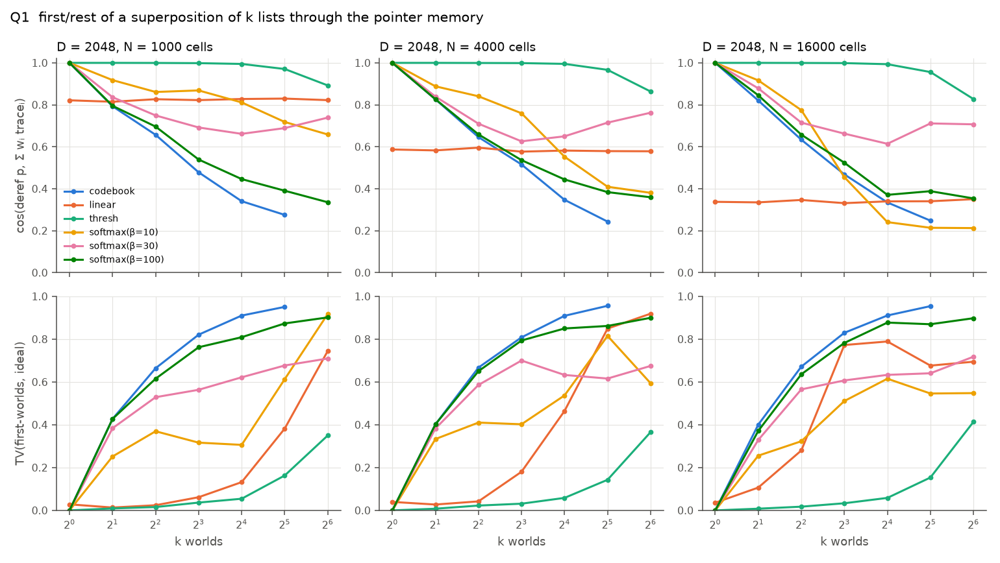
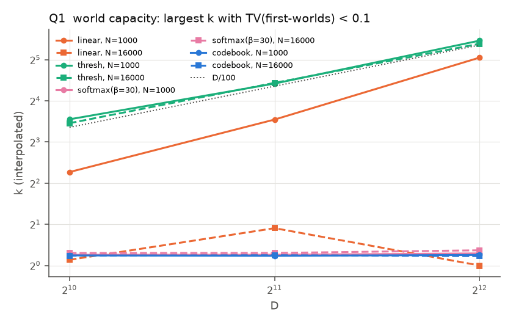
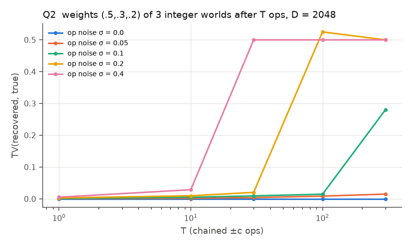
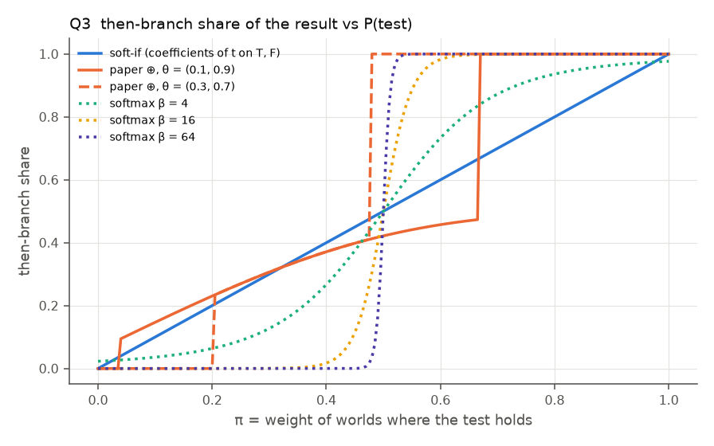
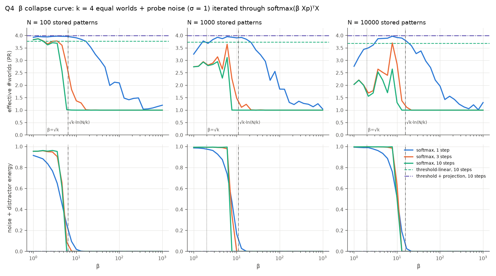
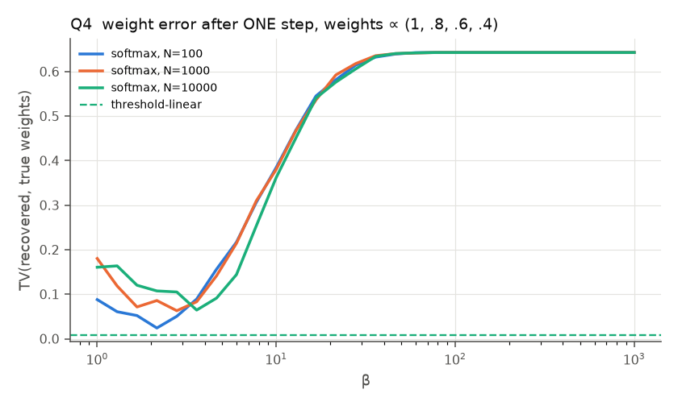
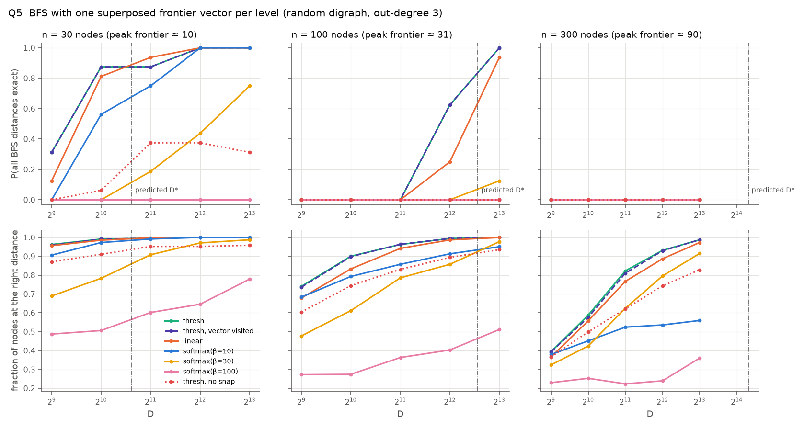

# W0: Superposition programming ("many worlds"), design spike

Status: spike finished. This document answers the six W0 questions in
`docs/PLAN.md` (P5) with measurements, and proposes the W1 design.

Everything is reproducible from `spikes/w0/`:

| script | question | output |
|---|---|---|
| `common.py` | prototype memory backends and world readout | |
| `q1_linearity.py` | 1: linearity through the pointer layer | `figures/w0-q1-*.png` |
| `q2_arith.py` | 2: arithmetic lifting, residue integers | `figures/w0-q2-arith-chain.png` |
| `q3_if.py` | 3: both-branch `if` vs the paper's ⊕; recursion | `figures/w0-q3-if-oplus.png` |
| `q4_beta.py` | 4: the β collapse curve | `figures/w0-q4-*.png` |
| `q5_bfs.py` | 5: BFS with one vector per level | `figures/w0-q5-bfs.png` |
| `amb_demo.clj` | what the current dialect does with superpositions | `spikes/w0/out/amb_demo.txt` |

Run with `OPENBLAS_NUM_THREADS=1 .venv/bin/python spikes/w0/qN_*.py` (Q1 about
25 min, Q4 about 20 min, the rest under 5 min each). Summaries and logs are
in `spikes/w0/out/`. The large per-trial files (`q1.json`, `q4.json`,
`q5.json`) are regenerated by the scripts and not committed. Seeds are fixed. `hdc.py` and
`core.clj` are unchanged; the spike's backends live in `spikes/w0/common.py`.

## TL;DR

- **Option 2 (superpositions of pointers) works, but not with a linear
  memory, and not with softmax.** A linear memory (Vᵀ K p) passes every
  world through, but it also passes every *other* stored trace through. Its
  fidelity is cos = 1/√(1 + N/D), with N the number of rows. Measured:
  0.82, 0.58 and 0.34 at N/D = 0.5, 2 and 8, which is exactly the formula.
  The interpreter's M holds thousands of traces, so this is unusable.
- **What does work is a threshold + projection memory**: find the support
  {j : |kⱼ·p|/|p| > τ}, with τ ≈ (√(2 ln N) + 1)/√D, then take least squares
  on that support. It keeps world weights (TV 0.01–0.06), it is **independent
  of memory load** (N from 1k to 16k makes no difference), it is idempotent,
  and on a single-world probe it returns exactly what the codebook returns.
  Capacity is linear in D: about **D/100 worlds** at weight error TV < 0.1
  (11, 22 and 44 worlds at D = 1024, 2048 and 4096), and about D/256 with the
  exact support ≥ 90 % of the time.
- **"β is the collapse knob" holds only half-way.** Raising β does move a
  superposed probe from a noisy blend to one world. But:
  1. β = 0 is not "keep all worlds". softmax(0) is the uniform mean of *all*
     traces, which does not depend on the probe at all.
  2. At every β that removes the distractors, softmax distorts the weights
     to ∝ exp(β wᵢ/|w|): TV ≥ 0.35 after one step.
  3. Under iteration, **no β keeps more than one world and also cleans up.**
     The window was empty in all 18 configurations (N ∈ {10², 10³, 10⁴},
     k ∈ {2, 4, 8}, equal and unequal weights). Theory says why: cleanup
     needs β ≳ √k·ln(N/k), but the k-world state is unstable for β > √k.

  So β is a good *measurement* operator and a poor *decoherence dial*. The
  regime that keeps worlds is a different separation function
  (threshold-linear), not a small β.
- **Arithmetic lifts exactly.** (amb 1 2) + 10 equals amb(11, 12) to
  3·10⁻¹⁶, and weights 0.3/0.7 come back as 0.3/0.7. Chains of 300 ops stay
  exact without noise. With op noise σ, the signal fraction decays as
  (1+σ²)^(−T), and the smallest worlds are lost first.
- **Superposition is run-time choice, not call-time choice.**
  `(let [x (amb 1 2)] (+ x x))` gives {2: ¼, 3: ½, 4: ¼}, not {2: ½, 4: ½}.
  Any binary op on two superposed operands forms the product of the
  distributions. This is the deepest semantic limit found, and it also
  affects the planned superposed machine states (W2.5). An exact fix exists:
  a "direct-sum" encoding that gives each world its own disjoint band of
  Fourier bins. It costs √k in SNR per world.
- **Both-branch `if` is the paper's ⊕ with the middle case corrected.** ⊕'s
  middle case ν(α·then + else) weights the branches α : 1 instead of
  π : 1−π, and it jumps at θ. ⊕'s outer cases are the useful part: they
  *prune*, which is lazy evaluation. Recursion with worlds that stop at
  different depths works exactly when the argument is split between the
  branches: `(dbl (amb 2 3 5))` gives {4, 6, 10} with weights .5/.3/.2 in 5
  levels. Without the split the recursion never terminates.
- **BFS in one vector per level works, but only for small frontiers.** It
  needs D ≳ 4·d·|F|max·(√(2 ln n)+1)², for example D = 8192 for 100 nodes.
  It has no FLOP advantage over enumeration: n·D per level instead of d·|F|.

**Recommendation for W1:** option 2 on a new `proj` memory backend
(threshold support + least squares). It is linear on the support and snaps
off it, so it is the "hybrid" of option 3 inside a single memory, and it can
be the default backend. Collapse becomes explicit (`collapse`/`sample`,
using the codebook or softmax). Run-time-choice semantics is documented, and
call-time choice is explicit enumeration (`for-worlds`). Details in §6.

---

## 0. Setup and definitions

- A **world** is one ordinary value vᵢ (an atom, an integer Bⁿ, or a pointer).
  A **superposition** is x = Σ wᵢ vᵢ with wᵢ ≥ 0 and Σ wᵢ = 1. Weights are
  linear coefficients, not squared amplitudes: every lifted op is linear, so
  the coefficients themselves carry the probability.
- **World readout** (`worlds`): orthogonal matching pursuit over a codebook
  C, with least squares on the growing support. It stops when the best
  residual match falls below z/√D, with z = √(2 ln |C|) + 1 (the maximum of
  |C| chance similarities plus a margin). Weights are the LS coefficients,
  clipped at 0 and renormalised. The error metric is the total variation
  TV(ŵ, w).
- **Memory backends** (heteroassociative, rows K → V, all in `common.py`):

  | name | read(p) | Universal-Hopfield "separation" |
  |---|---|---|
  | `codebook` | V[argmax K p] (the interpreter today) | hardmax |
  | `linear` | Vᵀ(K p) | identity |
  | `softmax(β)` | Vᵀ softmax(β K p/\|p\|)·\|p\| | exp (modern Hopfield / attention) |
  | `thresh` | Vᵀ (s ⊙ [\|s\|/\|p\| > τ]), s = K p | threshold-linear |
  | `proj` | V_Sᵀ K_S⁺ p, S = {\|s\|/\|p\| > τ} | threshold, then least squares |

  The framing follows Millidge et al. 2022 (Universal Hopfield Networks):
  similarity, then separation, then projection. The backends differ only in
  the separation function.

---

## 1. Linearity through the pointer layer

**Setup** (`q1_linearity.py`). N list cells with pointer K[j] → trace
V[j] = ν(L⊗A[first_j] + R⊗K[next_j]), 2000 atoms, and weights wᵢ ~ U(0.5, 1.5)
normalised (spread 3 : 1). first(p) = worlds(L ⊘ read(p)) over atoms.
rest(p) = R ⊘ read(p). The grid was D ∈ {1024, 2048, 4096} ×
N ∈ {1k, 4k, 16k} × k ∈ {1…64}, with 10 trials each.

**Answer: yes for `thresh`/`proj`, only at low load for `linear`, and never
for `codebook` or `softmax`.**



- **Linear memory.** Fidelity to the ideal Σ wᵢ traceᵢ does not depend on k
  and follows 1/√(1 + N/D) exactly:

  | N/D | measured cos | theory |
  |---|---|---|
  | 0.49 | 0.82 | 0.82 |
  | 1.95 | 0.58 | 0.58 |
  | 7.8 | 0.34 | 0.34 |

  The crosstalk is Σ_{j∉W} (kⱼ·p) vⱼ, whose energy is N/D. It is also
  *structured* noise: it lies in the span of the codebook, because it is made
  of other stored traces. So readout produces false worlds. At N = 16000,
  D = 2048 the linear memory holds about 2 worlds. With 1000 rows it holds
  about 12. The same holds for the capacity at D = 4096: 33 worlds at
  N = 1000, 16 at N = 4000, and about 1 at N = 16000.
- **Codebook** (the current interpreter) collapses. TV = 1 − w_max: 0.40 at
  k = 2 and 0.91 at k = 16. This is measurement, as expected.
- **Softmax** (β = 10, 30, 100) fails from k = 2 on (TV 0.25–0.43 at k = 2).
  The weights are exponentiated and the largest world wins; see §4.
- **Threshold-linear** keeps the trace (cos ≥ 0.99 up to k = 16) and the
  weights (TV 0.01–0.06 up to k = 16). It is **load-independent**:

  | D | worlds read with TV < 0.1 (N = 1k / 4k / 16k) | exact support ≥ 90 % |
  |---|---|---|
  | 1024 | 11.7 / 11.4 / 11.0 | 4–8 |
  | 2048 | 21.4 / 22.5 / 21.7 | 8 |
  | 4096 | 44.1 / 44.0 / 41.9 | 16 |

  

**The O(D) readout capacity.** A world is detectable when its share
wᵢ/|w| of the probe exceeds τ = z/√D. For k equal weights that gives
k < D/z², with z² ≈ 26–30 for N = 10³–10⁴, so about D/28 at the pointer
level. The first readout loses another factor of two, because a cell trace
splits its energy between L and R, and the 3 : 1 weight spread costs
another factor of about 2. The measured law, **k ≈ D/100** (TV < 0.1), is
consistent with this. Noiseless superpositions of random atoms read back
much further, about 200 worlds at D = 2048 (≈ D/10;
`out/q2_random_codebook.txt`). So the limit is set by the noise that each
memory step adds, not by the readout itself.

**Chains.** first(restᵈ(p)) must be right for d = 1…4. With `thresh` and a
readout onto the pointer codebook between steps ("clean"), all four levels
are right up to k = 4–8 at D = 2048 (4 at N = 1k, 8 at N = 4k and 16k). Without the readout ("raw"), only up to
k = 4. With `linear`, 4-deep chains fail beyond k = 1. **Cleanup between
steps is necessary, and it must itself be superposition-preserving**, which
is what `proj` does.

---

## 2. Arithmetic lifting under residue integers

(`q2_arith.py`, D = 2048)

- **Exactness.** B¹⁰ ⊗ ν(B¹ + B²) versus ν(B¹¹ + B¹²): the maximum absolute
  difference is 3·10⁻¹⁶. Weights 0.3·B¹ + 0.7·B² come back as (0.3000, 0.7000)
  after +10. Binding with a unitary vector distributes over the sum and
  preserves the norm, so this is exact by construction, and the numbers
  confirm it. The same holds in the dialect today (`amb_demo.clj`):
  `(similarity (+ (bundle 1 2) 10) (bundle 11 12))` gives 100.
- **Readout of integer worlds is the weak point.** Residue integers are
  correlated: n and m share p's band whenever p | n − m, and even
  non-sharing bands give a similarity of about −1/(p−1). OMP over the
  candidates [−1000, 1000] reads back:

  | worlds k | 1–4 | 6 | 8 | 12 |
  |---|---|---|---|---|
  | P(exact) | 100 % | 90 % | 50 % | 0 % |

  Random atoms of the same codebook size give about 200 worlds. There are
  also true **chimeras**: integers whose residues each match 11 or 12, such
  as ±13 079, ±62 974, ±73 139 and ±76 064 (8 of them within ±100 000). A
  chimera is exactly as similar to ν(B¹¹ + B¹²) as the two true worlds are.
  The interpreter's printer duly prints `(+ (bundle 1 2) 10)` as **646657**,
  a chimera. The fix is to read integers only against a bounded candidate
  range, and to fail loudly beyond about D/350 worlds.
- **Chains with op noise.** Three worlds with weights .5/.3/.2 go through
  T random ±c ops, with Gaussian noise of relative norm σ after each op.

  

  Without noise, T = 300 is exact (TV 10⁻¹⁵). With noise, the signal energy
  fraction is (1+σ²)^(−T), and a world is lost when
  wᵢ/|w|·(1+σ²)^(−T/2) < τ. Measured breakdown points: σ = 0.1 lasts to
  T ≈ 100, σ = 0.2 to T ≈ 30, and σ = 0.4 to T ≈ 10. The failure is
  graceful: the smallest worlds vanish first, and TV plateaus at 0.5 when
  only the .5 world is left. Interim `proj` cleanup resets the noise, which
  is the usual argument for cleanup every few ops.
- **Sharing (a correctness issue, not noise).** x = amb(1, 2):

  | expression | superposition gives | call-time choice would give |
  |---|---|---|
  | (+ x x) | {2: ¼, 3: ½, 4: ¼} | {2: ½, 4: ½} |
  | (+ x y), y = (+ x 10) | {12: ¼, 13: ½, 14: ¼} | {12: ½, 14: ½} |

  Binding two superpositions is bilinear: (ΣᵢwᵢBⁱ)(ΣⱼwⱼBʲ) produces every
  pair (i, j). In functional-logic terms this is **run-time choice**: every
  occurrence of a nondeterministic value chooses independently. **Call-time
  choice** is `let`-sharing, as in Curry or CRWL, and McCarthy's `amb`
  [verify refs].

  **Direct-sum worlds fix this exactly.** World i owns a disjoint random set
  Sᵢ of Fourier bins: x = Σ √k·Pᵢ(B^{xᵢ}). Binding is per-bin
  multiplication, so worlds never mix. The spike gets (+ x x) = {world 0: 2,
  world 1: 4} and (+ x y) = {12, 14}, both with weights ½/½. The costs:
  - each world has only D/k dimensions, so SNR drops by √k
  - k must be fixed when the worlds are created
  - memory lookups must be done per band. That is k lookups of D/k each,
    the same FLOPs as one full lookup, but it is enumeration in disguise.

  In the current dialect the question does not even arise.
  `(let [x (bundle 1 2)] ...)` snaps x to a chimera on lookup, because env
  lookup goes through the hardmax cleanup.

---

## 3. Both-branch `if` and the paper's ⊕

**The operator**, checked against arXiv 2510.17889, eq. 1:
a ⊕ b = [E‖a‖ > θ↑] a + [E‖a‖ < θ↓] b + [θ↓ ≤ E‖a‖ ≤ θ↑] ν(a + b). The paper
uses it as cond(r) = sim(car(car r), T)·cdr(car r) ⊕ cond(cdr r). So
a = α·then, with α = sim(test, T), and b is the lazily evaluated else
branch. θ↑ is "a little under 1" and θ↓ "a little over 0".

**Correspondence** (`q3_if.py`). Let the test be what a lifted predicate
returns, t = π T + (1−π) F, where π is the weight of the worlds in which the
test holds. The share of the then-branch in the result is:



| rule | mean \|share − π\| |
|---|---|
| soft-if: coefficients of t on {T, F}, so share = π | **0.000** |
| paper ⊕, θ = (0.1, 0.9) | 0.093 |
| paper ⊕, θ = (0.3, 0.7) | 0.163 |
| softmax(β·[α, α_F]), β = 4 / 16 / 64 | 0.104 / 0.215 / 0.240 |

Reading the curves:
- ⊕'s outer cases are hard selection. They are the β → ∞ limit of softmax
  branch selection.
- ⊕'s middle case is **not** the soft `if`. It weights then : else as α : 1,
  where α = cos(t, T) = π/√(π² + (1−π)²), so it sits below the diagonal
  (biased towards else). It also jumps at both thresholds.
- Softmax at any β is a sigmoid around π = ½. It is a decision rule, not a
  superposition.

**Proposed semantics** (⊕, corrected):

```
if(t, A, B) = [π > 1−ε]  A(env)                                  ;; ⊕ upper case: prune B
            + [π < ε]    B(env)                                  ;; ⊕ lower case: prune A
            + otherwise  π·A(P_T env) + (1−π)·B(P_F env)         ;; weights π : 1−π
```

with π read from the test's coefficients, and ε the detection floor τ. The
thresholds keep ⊕'s best property, **laziness**: a branch is only evaluated
if some world needs it.

**P_T/P_F (splitting the argument) is essential for recursion.**

| program, input | variant | result |
|---|---|---|
| `(dbl n)` = `(if (zero? n) 0 (+ 2 (dbl (dec n))))` on {2: .5, 3: .3, 5: .2} | with split | {4: .5, 6: .3, 10: .2} exactly, 5 levels; each world leaves at its own depth |
| same | without split | the 0-world keeps recursing into −1, −2, …; never terminates (stopped by the cap of 12) |
| `(len xs)` on three lists of length 2, 3 and 5 with .5/.3/.2 | no gain correction | {2: .60, 3: .275, 5: .086} |
| same | with gain √2 | {2: .477, 3: .31, 5: .195}, plus 0.02 spurious mass |

Without the gain correction every world shrinks by √2 per `rest`, because a
cell's R field carries 1/√2 of its trace. Worlds that exit deeper are
therefore under-weighted by 2^(−d/2). **Amplitude bookkeeping is a W1
requirement:** every field extraction must multiply by its known gain, and
that gain must be the same for every world.

**How to split, per kind of predicate:**
- `empty?`, `nil?`, `zero?` and `=` against a constant are linear functionals
  and projectors: π = coefficient of the constant, P_T x = π·c, P_F x = x − π·c.
  They need no enumeration.
- With residue integers the plain dot B⁰·x leaks: 5 shares p = 5's band with
  0, so the dot reads 1/6 of 5 as zero. The coefficient must come from a
  `worlds` readout (least squares), not from the dot product.
- A test on *several* superposed variables cannot be split without world
  identity, because of the run-time choice problem from §2. It needs
  enumeration.
- A nice property of the pointer memory: `rest` of `()` has no trace, so
  the finished world simply vanishes. That is why `len` works even without
  the split.

---

## 4. The β collapse curve

**Setup** (`q4_beta.py`). N stored patterns, a probe with k worlds, and
probe noise with the same norm as the signal. The probe is iterated through
p ← Xᵀ f(X p). After 1, 3 and 10 steps we measure:
- the effective number of worlds, as the participation ratio 1/Σŵ² of the
  least-squares world coefficients
- the energy outside the worlds' span ("noise + distractors")
- the weight error TV

The sweep covers 28 values of β in [1, 1000], with 8 seeds each.



**Theory** (derived here; the curves confirm it):
- With a normalised probe, world i scores wᵢ/|w| (1/√k for equal weights).
  Distractors score N(0, 1/D).
- One softmax step suppresses the distractors when
  k·e^{β/√k} ≫ N·e^{β²/2D}, that is **β ≳ √k·ln(N/k)**. For k = 4 that is
  6.4, 11 and 15.6 at N = 100, 1000 and 10 000. The measured noise curves
  drop exactly at these values (dash-dotted lines).
- Iterating softmax on the symmetric k-world state w = 1/k has gain β/√k
  on any perturbation that sums to zero. So the state is **unstable for
  β > √k**.
- Since √k·ln(N/k) > √k whenever N > e·k, **every β that cleans up also
  makes the multi-world state unstable.** The collapse time is about
  ln(1/δ₀)/ln(β/√k) steps, where δ₀ is the initial asymmetry of order 1/√D.

**Measured.** "Keeps worlds" means PR ≥ 0.8k, and "cleans" means noise
energy < 0.1.
- **One step:** there is a β window, but only for *equal* weights. For
  N = 1000, k = 4 it is β ∈ [12.9, 35.9]. For N = 10 000, k = 8 it is the
  single grid point β = 21.5. For unequal weights there is no window at all.
- **Ten steps:** **the window is empty in all 18 configurations.** Every β
  that cleans collapses to PR = 1.0 within 3–10 steps. The surviving world
  is the largest one, or chance picks it when the weights are equal.
- **Weight distortion after a single step,** with weights ∝ (1, .8, .6, .4):

  

  TV is 0.03–0.1 only at β ≈ 2–4, where the output is still > 90 % noise.
  At the β that cleans (≈ 10–15), TV is 0.35–0.5, and it rises to 0.64
  (= 1 − w_max) as β grows. The softmax weights are ∝ exp(β wᵢ/|w|).
- **Threshold-linear (`thresh`)** without least squares also degrades under
  iteration, only slowly: each step multiplies the weights by the support's
  Gram matrix, which amounts to power iteration. For k = 8 the PR goes from
  8 to 6.2 after 10 steps (TV 0.22).
- **Threshold + projection (`proj`)** is idempotent. After 10 steps, for all
  N and k: PR = 2.00 / 3.99 / 7.98 for equal weights (k = 2 / 4 / 8), TV
  0.007–0.046, noise energy 0.000.
- The **plan's premise "β = 0 is the linear memory"** is also false.
  softmax(0·s) is uniform, so the output is the mean of all V, whatever the
  probe. The linear memory is the first-order term (β/N)·Vᵀ K p, taken
  *after* subtracting that mean. It is the tangent of the softmax family at
  β = 0, not a member of it.

**Verdict on the hypothesis.** β is a **collapse knob** in the sense of
measurement. It interpolates monotonically from "noisy blend" to "argmax
world", and at high β it equals the codebook memory. That makes it the right
operator for `collapse`. It is **not** a dial that trades off worlds against
cleanliness:
- no β preserves the weights
- under iteration no β keeps more than one world while cleaning up

The regime that keeps worlds is a different separation function
(threshold + projection), outside the softmax family. P2 and P5 still tell
one story, but with a different axis: the separation function (hardmax,
softmax(β), threshold-linear) rather than β alone.

---

## 5. BFS with one vector per level

**Setup** (`q5_bfs.py`):
- a random digraph with n nodes and out-degree 3
- node atoms X, and an adjacency memory X[u] → Σ_{v∈N(u)} X[v]
- one read per level: y = mem(f), with f = Σ_{u∈frontier} X[u]
- next = {v : X[v]·y > ½·unit}, re-binarised into a clean set
  ("snap"); visited nodes are removed with a host bitset or with a
  superposed visited vector
- correctness means *every* node's BFS distance is right; there were 16
  graphs per cell



| n (peak frontier) | D for P(all exact) ≥ 0.9, `thresh` | node accuracy at D = 2048 |
|---|---|---|
| 30 (10) | 4096 (0.88 already at 1024–2048) | 0.996 |
| 100 (31) | 8192 (0.62 at 4096) | 0.963 |
| 300 (90) | > 8192 (0.988 of nodes right at 8192) | 0.82 |
| 1000 (290) | ≫ 8192 | 0.42 |

- **Scaling law.** A frontier of |F| nodes produces y with about d·|F| unit
  terms, so the noise per score is σ = √(d|F|/D). Detecting at ½ over n
  candidates needs ½/σ > √(2 ln n) + 1, that is
  **D\* ≈ 4·d·|F|max·(√(2 ln n)+1)²**. That predicts 1.5k, 5.8k and 20k for
  n = 30, 100 and 300. The measured transitions agree (dash-dotted lines).
  The frontier size, not n, is the capacity: it is the §1 world-capacity law
  again.
- **β.**
  - softmax β = 10 is roughly equal to `linear`.
  - β = 30 is worse: node accuracy at D = 4096 and n = 100 falls from 0.99
    (`thresh`) to 0.86.
  - β = 100 is useless (node accuracy 0.3–0.8). It collapses the frontier to
    one node, which is exactly the effect from §4.
  - `thresh` ≥ `linear` everywhere. The difference grows with n, since the
    linear crosstalk scales as √(n/D).
- **Snap is necessary.** Without re-binarising, y carries path counts
  (Aᵗx), and their dynamic range drowns the nodes that are reached only
  once (0.38 exact at best, at n = 30).
- **A superposed visited set works as well as a host bitset** in this range
  (identical curves).
- **Versus explicit enumeration.** Enumeration is always exact and costs
  d·|F| edge visits per level. The vector version costs two n×D
  matrix-vector products per level: for n = 100 and D = 8192 that is about
  1.6 MFLOP against about 90 edge visits. "One lookup per level" is the
  GraphBLAS formulation in a random basis, and it is O(nD). It is not a
  speed-up; its value is uniformity (one attention call per level).

---

## 6. Recommendation

### Which option

| option | verdict | evidence |
|---|---|---|
| 1. Linear traces (no pointers) | **reject** | This is the crosstalk that broke `(fact 5)`, and superposed tuples add more of the same. |
| 2. Superpositions of pointers, linear memory | **reject as stated** | Fidelity 1/√(1+N/D). Capacity falls with load (about 12 worlds at N/D = 0.5, about 2 at N/D = 8), and M only grows. |
| 2′. Superpositions of pointers, **`proj` memory** | **adopt** | Load-independent, weight-preserving, idempotent, about D/100 worlds; equals the codebook on a single-world probe. |
| 3. Hybrid regions | **subsumed** | `proj` *is* the hybrid: linear on the detected support, zero (snapping) off it. No region annotations are needed. |

`proj` can be the **default backend**. A single-world probe has a support
of one row and returns the trace exactly. The only extra cost over the
codebook is a least-squares solve on the support, which is tiny compared
with the N×D scan. Softmax(β) is kept for P2 cleanup experiments and as a
partial-collapse operator.

### W1 core changes (in the order they unblock things)

1. **Memory backend `proj`** in the pluggable interface (P0):
   `deref(p) = V_Sᵀ K_S⁺ p`, S = {j : |kⱼ·p|/|p| > (√(2 ln N)+1)/√D}.
   Also `recall-super(p) = (S, c)`, which `worlds` uses.
2. **Amplitude-exact field access.** `car`/`cdr`/`get` multiply by the
   trace's known field gain (√2 for cells). Map and set traces have
   several nested ν factors: either store the traces unnormalised with a
   per-row scale, or store the scale in the memory row. Without this, worlds
   at different depths get different weights (§3).
3. **Destructors lift and constructors enumerate.** first, rest, get, nth,
   lookup, inc/dec, + with *one* superposed operand, and the similarity
   predicates are linear. cons(Σ wᵢaᵢ, r) must enumerate the worlds and
   build k cells, then superpose the pointers. Hash-consing then merges
   equal worlds, so amplitudes add, which is the correct marginalisation.
4. **The environment must not snap.** Today `lookup` → `cdr` → hardmax
   cleanup collapses a `let`-bound superposition (to a chimera, for
   integers). Route value slots through `proj`.
5. **Superposition-aware `if`** as specified in §3: π from the coefficients,
   ε-pruning, and a split argument for single-variable tests. Tests on
   several superposed variables fall back to enumeration.
6. **Integers:** unboxed in superpositions, since arithmetic lifts exactly.
   `worlds` reads them against a bounded candidate range and throws above
   the integer world capacity (≈ D/350; 6 at D = 2048).

### Language API (precise semantics)

Let ⟦x⟧ = {vᵢ ↦ wᵢ} denote the worlds of x (weights ≥ 0, Σ = 1).

| form | semantics |
|---|---|
| `(superpose {a wa, b wb, …})` | x = Σ (w/Σw)·slot(v). Equal values merge, and their weights add. |
| `(amb a b …)` | `(superpose {a 1, b 1, …})` |
| `(worlds x)` | the host map ⟦x⟧, found by OMP + LS over M ∪ the integer candidates. **Throws** "superposition capacity exceeded" when the residual energy after readout exceeds the noise budget, or when k > capacity(D). Never returns silent garbage (same policy as maps). |
| `(weight x v)` | ⟦x⟧(v), or 0 |
| `(collapse x)` | argmax world (the codebook read, i.e. softmax as β → ∞). Deterministic. |
| `(collapse x β)` | *partial* collapse: reweight ∝ exp(β·wᵢ/\|w\|). Documented as distorting weights (§4). |
| `(sample x)` | one world, drawn with p ∝ w (seeded host RNG) |
| `(assert p x)` | post-selection: {v ↦ w·[p(v)] / Z}. O(k) calls to p; linear predicates need no enumeration. Throws if Z = 0. Classical conditioning, not Grover. |
| `(for-worlds [v x] body)` | explicit enumeration, which gives **call-time choice**: v is one world inside body. The result is Σ w·body(v). |
| lifted ops on a superposed x | `(f x)` = Σ wᵢ f(vᵢ) for every f that is linear in x. `(f x y)` with **both** operands superposed = Σᵢⱼ wᵢwⱼ f(xᵢ, yⱼ), which is **run-time choice** and must be documented. `(let [x (amb 1 2)] (+ x x))` is {2 ¼, 3 ½, 4 ¼}; use `for-worlds` to share. |
| `(if t a b)` with superposed t | §3: weights π : 1−π, lazy pruning at ε, argument split for single-variable tests |

### Where it breaks (risks)

1. **Capacity.** About D/100 worlds per step at TV < 0.1 (22 at D = 2048),
   and exact support only up to about D/256 (8). Integer worlds: 6. The
   exponential claim needs the factored form plus a resonator search (W2.3).
2. **Run-time choice.** This is the biggest semantic risk. It also hits W2.5
   (superposed machine states): stepping Σ wᵢ sᵢ through a binary primitive
   mixes worlds unless the states are direct-sum encoded (§2), which costs
   √k SNR and fixes k in advance. Prototype direct-sum states before
   committing W2.5.
3. **Recursion whose depth differs between worlds** works only with the
   split `if` and exact amplitude gains. Tests that mix several superposed
   variables force enumeration at that branch. Unsplit both-branch recursion
   does not terminate.
4. **Depth and noise.** Each memory step adds crosstalk. At D = 2048 a
   cleaned 4-deep `first(restᵈ)` chain is exact up to k = 4–8. Op noise
   decays the signal as (1+σ²)^(−T), so a `proj` cleanup is needed every
   few ops, and it loses the smallest worlds first.
5. **Softmax distorts weights.** Any P2 "soft" backend used under
   superposition silently changes the probabilities. Keep it out of the W
   path, or label it as collapse.
6. **Residue chimeras** make integer readout ambiguous beyond a few worlds.
   The printer already prints chimeras for superposed integers (646657 for
   amb(11, 12)).
7. **Cost.** `worlds` is O(k·N·D). BFS-style "one lookup" is still O(nD)
   per level, with no FLOP advantage over enumeration.
8. **Weights are real, non-negative coefficients.** There is no quantum
   interference. `proj` could carry signed coefficients (softmax cannot),
   but no W1 feature needs them.

### Suggested W1 acceptance tests

- `(worlds (first (amb '(a b) '(c d))))` = {a ½, c ½} ± 0.02, at N = 16k
  rows in M
- `(worlds (+ (amb 1 2) 10))` = {11 ½, 12 ½} exactly
- `(worlds (dbl (superpose {2 .5, 3 .3, 5 .2})))` = {4 .5, 6 .3, 10 .2}
- `(worlds (len (superpose {'(a b) .5, '(a b c) .3, '(a b c d e) .2})))`
  within TV 0.03
- `(worlds (let [x (amb 1 2)] (+ x x)))` = {2 ¼, 3 ½, 4 ¼} (documented
  run-time choice), and `for-worlds` gives {2 ½, 4 ½}
- capacity: `worlds` of 64 superposed lists at D = 2048 throws rather than
  lies

---

## Prior work

- **Computing in superposition with VSAs.** Kanerva (2009), and Plate's HRR
  (1995/2003). Frady, Kleyko & Sommer (2018) give a capacity theory for
  reading items out of superpositions, which matches our O(D) law [verify
  exact title and venue]. Frady, Kleyko, Kymn, Olshausen & Sommer, "Computing
  on functions using randomized vector representations" (VFA, 2021/22),
  treat superposed function values [verify]. Kleyko et al.'s VSA survey
  (2022/23) collects "computing in superposition" results [verify].
- **Resonator networks.** Frady, Kent, Kanerva, Olshausen & Sommer 2020,
  *Resonator networks, 1*, and Kent, Frady, Sommer & Olshausen 2020,
  *Resonator networks, 2* (Neural Computation 32(12)) [verify issue]. They
  factor a product (Σa)⊗(Σb)⊗(Σc) by iterating per-factor cleanups. This is
  the tool for W2.3, and it is itself a collapse process (an iterated
  hardmax or projection).
- **Probabilistic reading.** Furlong & Eliasmith (2022), *Fractional Binding
  in Vector Symbolic Architectures as Quasi-Probability Statements*
  (CogSci 44), read bundles and FPE superpositions as quasi-probability
  distributions. Furlong & Eliasmith (2023), *Modelling neural probabilistic
  computation using vector symbolic architectures* (Cognitive Neurodynamics).
  Our weights-as-coefficients reading is the discrete-codebook case of this.
  Their negative "quasi" mass corresponds to the negative LS coefficients we
  clip.
- **Associative memory.** Ramsauer et al. 2020 (modern Hopfield = attention;
  their *metastable states* averaging several patterns are the one-step
  multi-world regime of §4, and they need clustered patterns). Krotov &
  Hopfield 2016 (dense associative memory). Millidge et al. 2022, *Universal
  Hopfield Networks* (ICML): the similarity, separation and projection
  decomposition used here; `proj` is a threshold separation followed by a
  pseudo-inverse projection.
- **Sparse recovery.** `worlds` is orthogonal matching pursuit (Tropp &
  Gilbert 2007) [verify]. The detection threshold √(2 ln N)/√D is the
  standard maximum of N Gaussians.
- **Nondeterminism semantics.** McCarthy's `amb` (1963). Call-time vs
  run-time choice in functional-logic programming: Hussmann (1993);
  González-Moreno et al. (CRWL, 1999); Curry [verify all three]. Our
  superpositions are run-time choice by construction.
- **Residue HDC.** Tomkins-Flanagan & Kelly, *…We Did (More of) It!* (arXiv
  2511.08767). Kymn et al., *Computing with residue numbers in
  high-dimensional representation* [verify authors and year]. The
  chimeras of §2 are the superposition-side cost of that encoding.
