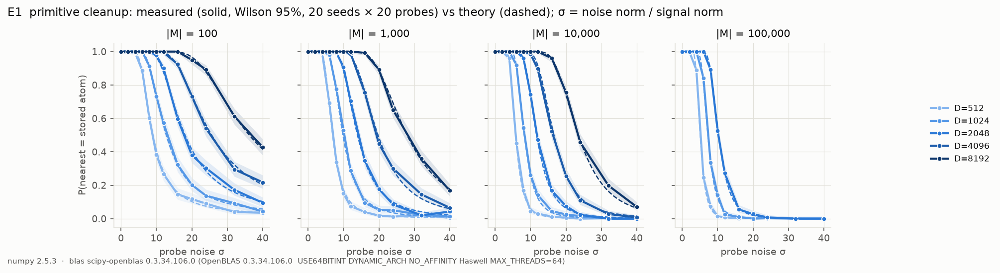
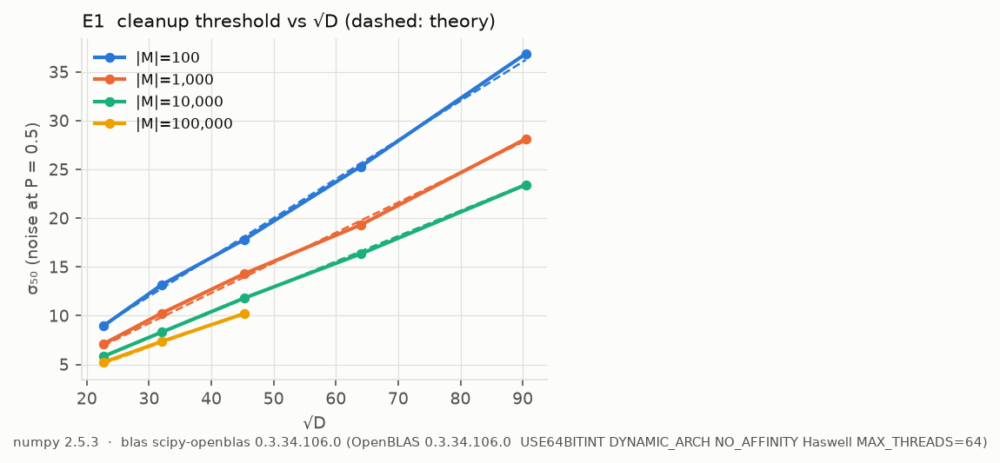
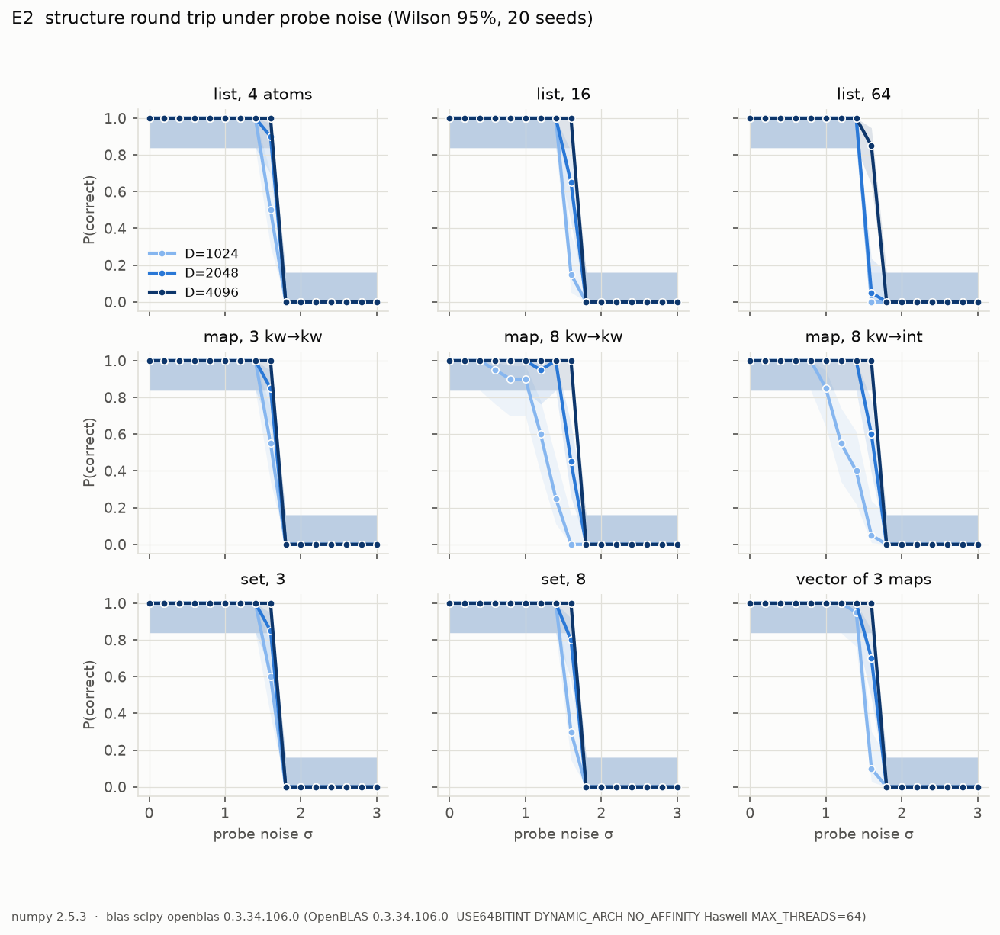
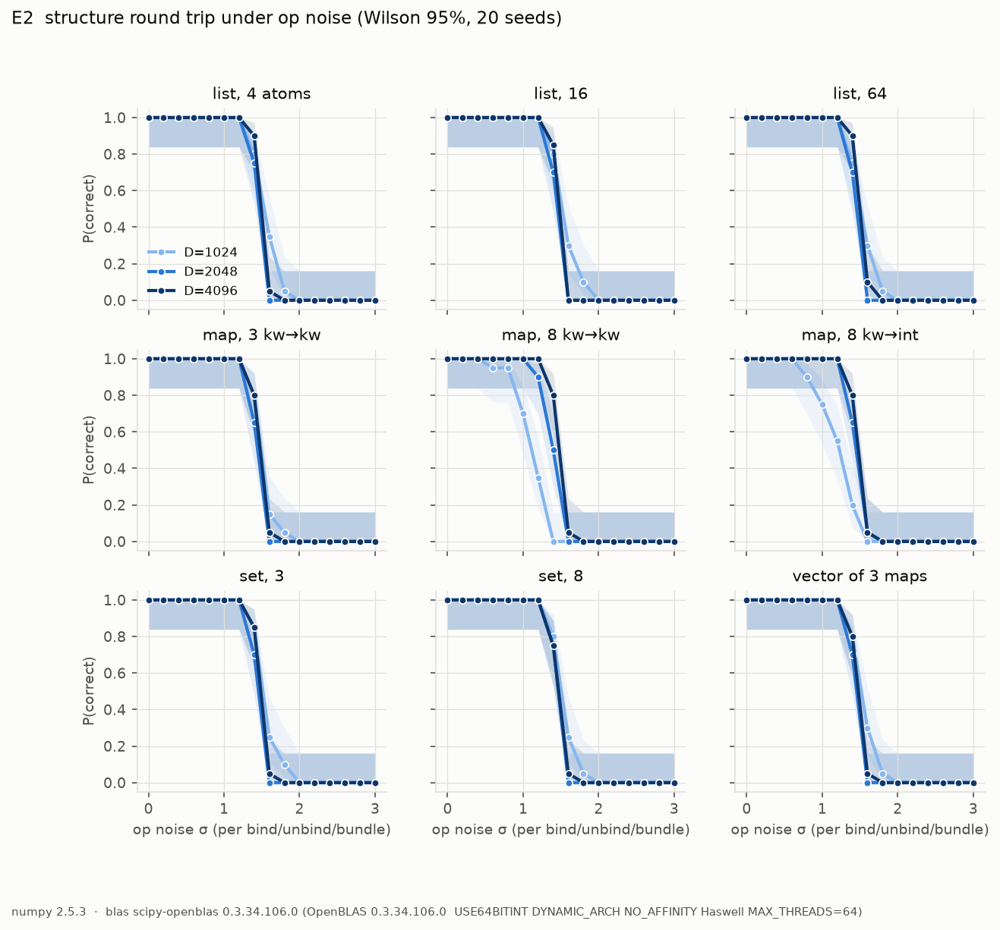
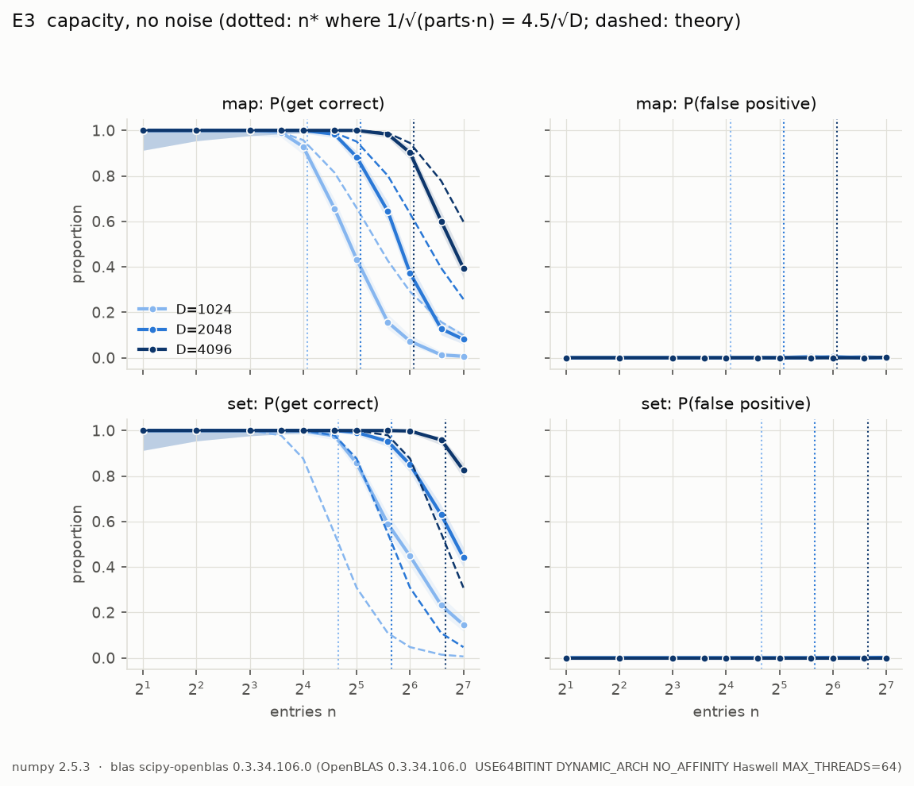
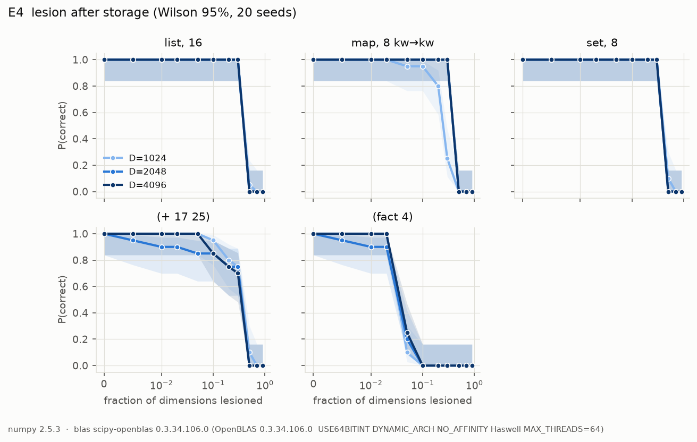
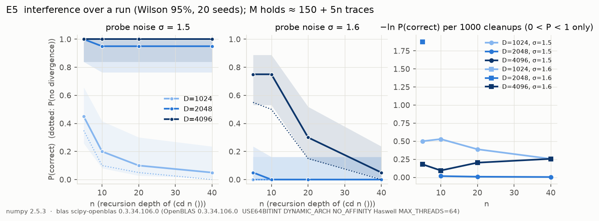
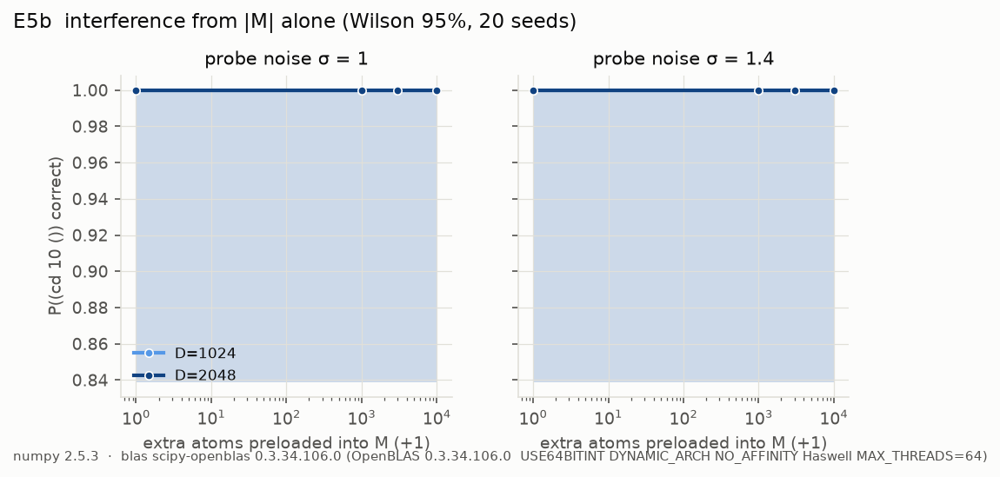
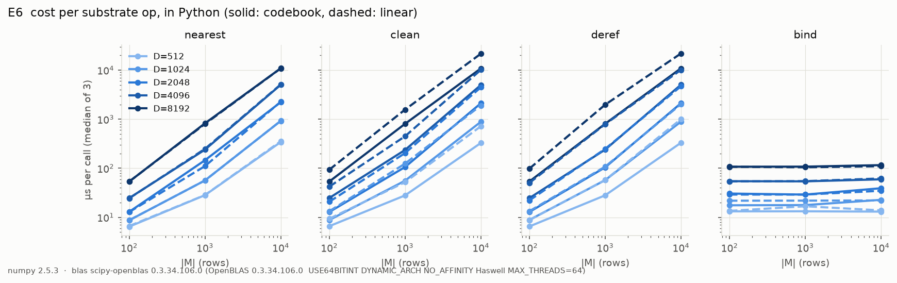
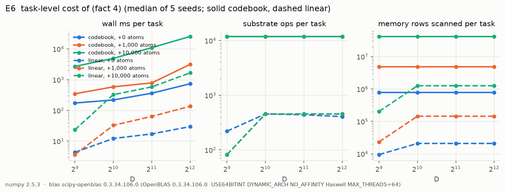

# P1 results: codebook robustness curves

All runs use the `codebook` backend (hardmax table cleanup), numpy 2.5.3 on
scipy-openblas 0.3.34 (Haswell kernel, 1 BLAS thread), 2 JVM workers.
Every proportion is pooled over all trials of all seeds and shown with a
Wilson 95% interval. Reproduce any figure with

```sh
clojure -M:jvm:exp specs/eN.edn && .venv/bin/python scripts/plot.py eN
```

Knob conventions (see `resources/vsc/hdc.py`, `Space.configure`): noise σ is
*relative*, v ↦ v + σ‖v‖/√D · z with z ~ N(0, I), so a unit vector gets
noise of expected norm σ. Op noise acts on every bind/unbind/bundle output;
probe noise on every cleanup probe (memory lookups, pointer derefs,
explaining-away steps, integer readout, kind checks). In E2–E5 structures
and programs are set up noise-free, then the knob is switched on for the
evaluation *and* the decoding (the printer is part of the round trip).

**Summary.** The codebook itself behaves exactly as the textbook model
predicts (E1: theory inside the 95% band at 207 of 216 points, σ₅₀ ∝ √D, a
weak log|M| dependence). But the *interpreter* does not fail where the
codebook fails. It fails 7–15× earlier, at D-independent cliffs set by its
own fixed similarity thresholds (θ = 0.5 for recognising a kind, θ = 0.4
for a global binding), and the cliff positions follow from those thresholds
in closed form (σ = √3 for probe noise, 1.46 for op noise). More dimensions
do not move those cliffs; they only sharpen them (E5). The expectation in
PLAN.md ("a sharp threshold in σ that moves right as √D grows") holds for
primitive cleanup and is false for everything built on top of it.

Further results:
- Capacity is linear in D, with n90 ≈ D/64 map entries or D/36 set members.
  The enforced caps sit at P ≥ 0.98, and false membership stays ≤ 0.06%
  even at 3× capacity (E3).
- Stored structures survive 30% dead dimensions at every D. Computation
  does not: `(fact 4)` has f₅₀ ≈ 4%. The integer 0 is a one-dimensional
  delta vector, so losing dimension 0 kills all arithmetic (E4).
- The size of M has no measurable effect on correctness at the noise levels
  the interpreter survives: 10⁴ extra atoms, 320 of 320 runs correct. It
  does affect speed, linearly (E5b, E6).
- The linear (β = 0) backend cannot run ordinary code at all (E6).

---

## E1: primitive cleanup




A codebook of |M| random unitary atoms is probed with one of them plus
probe noise σ; success = `nearest` returns that atom. D ∈ {512 … 8192},
|M| ∈ {10², 10³, 10⁴, 10⁵} (10⁵ only up to D = 2048: 10⁵ × 8192 float32
rows would be 3.3 GB), 12 noise levels, 20 seeds × 20 probes per point
(4 320 runs, 380 s on 2 workers).

Theory (dashed): the true atom scores 1 + ε₀ with ε₀ ~ N(0, σ²/D); each
distractor scores εᵢ ~ N(0, (1 + σ²)/D). P(correct) = P(1 + ε₀ > maxᵢ εᵢ) is
integrated numerically (`p_cleanup` in `scripts/plot.py`).

- **Theory and measurement agree.** Mean |measured − theory| = 0.007, max
  0.050. The theory curve lies outside the Wilson interval at 9 of 216
  points (4%, which is what a 95% interval should give).
- **The threshold moves with √D.** σ₅₀ (the noise at P = 0.5):

  | \|M\| | D=512 | 1024 | 2048 | 4096 | 8192 |
  |---|---|---|---|---|---|
  | 10² | 8.9 | 13.2 | 17.8 | 25.3 | 36.9 |
  | 10³ | 7.1 | 10.3 | 14.3 | 19.3 | 28.1 |
  | 10⁴ | 5.8 | 8.3 | 11.8 | 16.3 | 23.4 |
  | 10⁵ | 5.2 | 7.4 | 10.2 | – | – |

  From D = 512 to 8192 (√D × 4) σ₅₀ grows × 4.1 (|M| = 10²) and × 4.0
  (|M| = 10⁴). Theory: 9.0 / 12.8 / 18.1 / 25.6 / 36.2 for |M| = 10²; every
  measured σ₅₀ is within 5% of it.
- **The load dependence is weak, as predicted.** 1000× more atoms
  (10² → 10⁵ at D = 2048) lowers σ₅₀ only from 17.8 to 10.2, about
  √(ln|M|) scaling.
- **A clean probe survives noise many times its own norm.** At D = 2048
  and 10⁴ stored atoms, noise of norm 11.8 (cosine to the target 0.085)
  still cleans up half the time.
- The curves bottom out at 1/|M|, not at 0 (chance), visible for |M| = 10².

## E2: structure round trips




Nine structures (lists of 4/16/64 symbols, maps of 3 and 8 keyword →
keyword, a map of 8 keyword → integer, sets of 3 and 8 keywords, a vector of
3 small maps) are stored as `(def x (quote …))`, then `x` is evaluated and
decoded under the knob. D ∈ {1024, 2048, 4096}, σ ∈ 0 … 3 in 16 steps,
20 seeds, 8 640 runs per figure (≈ 5 min each).

- **Every structure falls off one cliff, at the same σ for every D.**
  Probe noise: P = 0.5 at σ ≈ 1.6–1.7 for all nine structures and all
  three D (range 1.26–1.70; the low values are the 8-entry maps at
  D = 1024, below). Op noise: σ₅₀ = 1.46–1.53 for everything except the
  8-entry maps at D = 1024.
- **The cliffs are the interpreter's thresholds, and their position is
  computable.** Under probe noise σ, a perfectly clean vector's cosine to
  its own noisy probe is 1/√(1 + σ²). `kind` needs > θ_atom = 0.5, so every
  kind check fails at σ = √3 = 1.73 (every run above σ = 1.8 failed with
  "cannot evaluate an unrecognised vector": 3 717 of 3 722 errors; the other 5 hit the op budget). Under op
  noise the first thing to go is the global lookup: sim(L ⊘ F(L⊗x), x) is
  0.707 without noise (the slot is ν(L⊗x + R⊗v)) and ≈ 0.707/√(1 + σ²) with
  it; it has to exceed θ_def = 0.4, which gives σ = 1.46. Measured: 1.46–1.50
  at D = 2048 and 4096. All 4 367 op-noise errors are "unable to resolve
  symbol: x".
- For comparison, E1 says the underlying argmax at this |M| (≈ 150 rows)
  survives σ ≈ 15 at D = 2048. The interpreter throws away an order of
  magnitude of robustness in its fixed thresholds. A threshold that scales
  with the expected noise (or a decision by margin rather than by absolute
  similarity) is the obvious fix and a P2/P3 question.
- **Below the cliff, only maps show structure-dependent loss, and it is
  silent.** Lists and sets of up to 64 elements round-trip perfectly up to
  σ = 1.4. Maps with 8 entries at D = 1024 start losing at σ ≈ 0.6
  (op noise: ≈ 0.6, σ₅₀ = 1.11; probe noise σ₅₀ = 1.26); at D = 2048 they
  hold to ≈ 1.2. All 65 pre-cliff failures were wrong values, not errors:
  a value slot is recalled by an unthresholded argmax over M, so a lost
  value comes back as some other stored atom (`{… :k7 #prim symbol?}`,
  `{… :k5 do}`, `{… :k2 :v4}`). The recall share of one value in an
  8-entry map trace is 1/√24 ≈ 0.20, which is why maps go first.

## E3: capacity



A map (keyword → keyword) or set of n keywords is stored as a quoted
literal with capacity enforcement off, then queried without noise:
`(get m k)` (maps) or `(contains? s k)` (sets) for up to 24 present keys,
`(contains? m z)` for 24 absent keys. D ∈ {1024, 2048, 4096},
n ∈ {2 … 128}, 20 seeds, 2 640 runs, 11 min. Dotted lines: n* where an
item's share of the trace, 1/√(parts·n), meets the chance floor 4.5/√D
(parts = 3 for maps, 2 for sets).

P(get correct):

| | n = 16 | 24 | 32 | 48 | 64 | 96 | 128 | enforced cap | n90 |
|---|---|---|---|---|---|---|---|---|---|
| map, D=1024 | 0.93 | 0.66 | 0.43 | 0.16 | 0.07 | 0.01 | 0.01 | 10 | 16.8 |
| map, D=2048 | 1.00 | 0.98 | 0.88 | 0.64 | 0.37 | 0.13 | 0.08 | 21 | 30.7 |
| map, D=4096 | 1.00 | 1.00 | 1.00 | 0.98 | 0.90 | 0.60 | 0.39 | 43 | 64.2 |
| set, D=1024 | 1.00 | 0.98 | 0.86 | 0.59 | 0.45 | 0.23 | 0.15 | 16 | 29.1 |
| set, D=2048 | 1.00 | 1.00 | 0.99 | 0.95 | 0.85 | 0.63 | 0.44 | 32 | 56.2 |
| set, D=4096 | 1.00 | 1.00 | 1.00 | 1.00 | 1.00 | 0.96 | 0.82 | 64 | 110 |

- **Capacity is linear in D**, as the README claims: n90 doubles with D
  (maps 16.8 → 30.7 → 64.2, sets 29 → 56 → 110), i.e. n90 ≈ D/64 for maps
  and ≈ D/36 for sets.
- **The enforced capacity is conservative by ≈ 1.5×.** At the cap that
  `check-capacity` enforces (maps 10/21/43, sets 16/32/64) every measured
  P(get) is ≥ 0.98. n* from the plan's 1/√(parts·n) = 4.5/√D criterion
  (maps 17/34/67, sets 25/51/101) sits at P ≈ 0.9: it is a good rule of
  thumb for the 90% point, and the enforced cap adds a 1.25× margin on top.
- **Maps fail before sets at equal n**, because an entry has a smaller
  share (three parts in the trace, not two) and a get needs two decisions
  (membership, then an unthresholded recall of the value slot).
- **False positives stay at zero, even far over capacity**: 9 of 15 840
  absent-key probes on maps and 4 of 15 840 on sets said "present"
  (0.06% / 0.03%), across all n up to 3× the capacity. Overload makes the
  structure forget, not hallucinate membership. (Values are another matter:
  a forgotten value comes back as a wrong atom, as in E2.)
- **Theory vs measurement (dashed).** For maps the dashed curve models only
  the value recall (share 1/√(3n) against |M| chance similarities, the E1
  integral). It is optimistic by ≈ 1.3× in n, because it ignores the
  membership test that runs first. For sets the dashed curve is the O(1)
  membership path alone (share must clear max(share/2, 4.5/√D)). It is
  pessimistic, because the ambiguous band is rescued by explaining away. The
  two bracket the measurements. A model of the whole adaptive membership
  rule is still to do.
- This experiment exposed two runaway modes of an overloaded structure (a
  garbage count, a cyclic cdr chain). Both are now caught (see the end of
  this document). The numbers above are from the third run with those
  guards and per-query budgets; the first two runs gave the same n90 and n50
  to within 2%.

## E4: lesion



The structure is stored, then a fixed random fraction f of the dimensions
is killed: stored rows are zeroed there and renormalised, and every vector
produced or compared afterwards (host-held copies included) is zero there.
D ∈ {1024, 2048, 4096}, f ∈ {0, 0.005 … 0.9}, 20 seeds, 3 300 runs.

- **Stored structures degrade gracefully, and D does not matter.** A
  16-list, an 8-set and an 8-map read back perfectly up to f = 0.3 and fail
  at f = 0.5 (f₅₀ ≈ 0.40 for all D; the 8-map at D = 1024 is the exception
  with f₅₀ = 0.26). That is the paper's "degrades gracefully" claim holding
  up: 30% of the cells can die. The failures are again threshold failures
  ("unable to resolve symbol: x", the global lookup, 536 of 536 structure
  errors). Lesion removes signal *systematically* (every vector loses the
  same share), it does not add noise that averages out, so more dimensions
  buy nothing.
- **Computation does not degrade gracefully.** `(+ 17 25)` has f₅₀ ≈ 0.37,
  but `(fact 4)` (a recursive multiply built from `+`, `dec` and `zero?`)
  has f₅₀ ≈ 0.04 at every D: after 5% lesion it fails 75% of the time. Every
  bind output is lesioned again, so an integer computed by a chain of k
  binds keeps only about (1 − f)^k of its signal, and the residue-number
  readout then misreads it. Most failures print `#hdv ?` (an integer
  nobody recognises) or loop until the time budget, because `zero?` never
  becomes true.
- **Surprise: the integer 0 is a single dimension.** A few seeds fail
  `(+ 17 25)` and `(fact 4)` at f = 0.005 (10 dead dimensions of 2048),
  and they keep failing at every larger f. B⁰ is the identity of circular
  convolution, a delta at index 0, and `+` folds from B⁰. If dimension 0
  is among the dead, 0 is the zero vector and all arithmetic is gone. That
  is a probability-f event per machine, and it matches: seed 19 at
  f = 0.005 and seeds 10 and 19 from f = 0.01 on (D = 2048). Every other
  value is spread over all dimensions. Fix, not yet applied: encode
  n as B^n ⊗ Z for a fixed random unitary Z (then 0 = Z is dense), or
  exclude index 0 from lesion masks. This is a real fragility of the
  integer encoding, not of the lesion model.

## E5: interference over a run



`(cd n ())` builds `(1 … n)` by recursion, so the run length grows with n
(1 597 cleanups at n = 5, 11 712 at n = 40) and M with it (≈ 150 + 5n
traces). Probe noise σ ∈ {1.5, 1.6}, just below the E2 cliff; D ∈ {1024,
2048, 4096}; 20 seeds, each paired with a noise-free reference run
(first-divergence = the first cleanup whose winner differs).

| σ | D | n=5 | n=10 | n=20 | n=40 |
|---|---|---|---|---|---|
| 1.5 | 1024 | 0.45 | 0.20 | 0.10 | 0.05 |
| 1.5 | 2048 | 1.00 | 0.95 | 0.95 | 0.95 |
| 1.5 | 4096 | 1.00 | 1.00 | 1.00 | 1.00 |
| 1.6 | 1024 | 0 | 0 | 0 | 0 |
| 1.6 | 2048 | 0.05 | 0 | 0 | 0 |
| 1.6 | 4096 | 0.75 | 0.75 | 0.30 | 0.05 |

- **Here D matters, because it sets how sharp the cliff is.** The cliff's
  *position* is fixed by the threshold (σ = √3 for kind checks), but a
  probe's cosine scatters around 1/√(1 + σ²) by ≈ 1/√D. Near the cliff every
  cleanup is a Bernoulli trial whose failure probability falls steeply with
  D, and a longer run is more trials. At σ = 1.6 and D = 4096, P(correct)
  goes 0.75 → 0.05 from n = 5 to 40, about 0.2 failures per 1000 cleanups
  (right panel). At D = 1024 the same σ kills the run within its first
  45–70 cleanups (median first divergence).
- **So the "interference" is from run length, not from M.** In this
  experiment M never holds more than ≈ 350 traces. The failure hazard per
  cleanup is roughly constant in n for a given (σ, D), so P(correct) decays
  geometrically with the number of cleanups, and E5b (below) shows that
  |M| itself has no measurable effect at these noise levels. The GC for M
  that PLAN.md makes conditional on E5 is **not** needed for correctness
  at this scale; it may still be needed for speed (E6).
- **Failures are varied, not just one kind.** Of the 258 errors: 131
  unrecognised vectors (a kind check), 24 `unable to resolve symbol: if` (a
  special form not recognised, so `if` was looked up as a variable), 28
  unknown primitives (`cons`, `dec`, `zero?` recalled but not matched),
  40 arity errors (a parameter list or argument list lost or gained an
  element), 35 "not a function" (a closure's form read back as a
  corrupted closure, e.g. `(fn #hdv ? [n acc] …)`). Some runs still returned
  a result after diverging, which is how the dotted P(no divergence) line
  sits below P(correct).
- A first attempt at σ ∈ {1.0, 1.4} (kept as `out/e5-mild.csv`, not
  plotted) was almost flat: everything correct except D = 1024 at σ = 1.4,
  n = 40 (0.85) and n = 60 (0.70). That is consistent with the table above.

### E5b: interference from |M| alone



A fixed program, `(cd 10 ())`, on a memory preloaded with 0 … 10⁴ extra
random atoms (a large vocabulary), at probe noise σ = 1.0 and 1.4,
D ∈ {1024, 2048}, 20 seeds, each paired with a noise-free reference run.

- **No effect at all: 320 of 320 runs are correct**, including 10⁴ extra
  atoms at D = 1024 and σ = 1.4. This is what E1 predicts. At σ = 1.4 the
  argmax at |M| = 10⁴, D = 1024 still has a margin of ~6σ₅₀ to spare
  (σ₅₀ = 8.3), so the size of M is irrelevant until noise approaches that
  level, and the interpreter's thresholds (E2) stop everything long before.
  The first design had 3·10⁴ atoms; those runs were dropped because they
  were slow, not because they were interesting (each cleanup then scans
  3·10⁴ rows, so `(cd 10 ())` takes ≈ 45 s; see E6).
- 8 of 320 runs diverged from their reference at cleanup 2902 of 3042 and
  were still correct: the same seed at D = 2048 for every load and σ,
  consistent with a near-tie between two equally valid answers (an
  explaining-away step can peel two constituents in either order). So
  "first divergence" is an upper bound on "first failure", not the same
  thing.

## E6: cost




Per-op cost measured inside Python (no host bridge), median of 3.

| D | \|M\| | bind µs | nearest µs (codebook) | clean µs (codebook / linear) |
|---|---|---|---|---|
| 512 | 10² | 13 | 6.5 | 6.6 / 9.4 |
| 2048 | 10³ | 29 | 146 | 106 / 204 |
| 2048 | 10⁴ | 39 | 2 228 | 2 112 / 4 466 |
| 8192 | 10³ | 108 | 824 | 806 / 1 571 |
| 8192 | 10⁴ | 116 | 10 910 | 10 813 / 21 624 |

- **A table cleanup costs D·|M| and is memory-bound.** 10⁴ × 8192 float32
  rows (328 MB) take 10.9 ms per scan, i.e. ≈ 30 GB/s, the machine's memory
  bandwidth. From |M| = 10³ to 10⁴ the cost grows × 10–15 (the matrix drops
  out of cache).
- **bind is O(D log D) and negligible** next to any cleanup once |M| ≳ 100.
- **The linear readout costs 2×** (a second pass, Mᵀ(Mp)); `nearest` is the
  same for both backends.
- An explaining-away `peel` of 8 items costs ≈ 8 cleanups (86.7 ms at
  D = 8192, |M| = 10⁴), which makes map and set enumeration the most
  expensive primitive.

Task level: `(fact 4)` on a hand-rolled multiply, through the whole
interpreter and host bridge, 5 seeds.

| D | extra atoms | wall ms | substrate ops | rows scanned | \|M\| |
|---|---|---|---|---|---|
| 512 | 0 | 174 | 11 888 | 0.79 M | 208 |
| 4096 | 0 | 736 | 11 888 | 0.79 M | 208 |
| 1024 | 10⁴ | 4 927 | 11 888 | 41.7 M | 10 208 |
| 4096 | 10⁴ | 25 405 | 11 888 | 41.7 M | 10 208 |

- **The op count is a property of the program, not of D or |M|**: 11 888
  substrate ops (about 3 000 cleanups) in every codebook run. So wall time
  is (ops × bridge overhead) + (rows scanned × D × ≈ 0.13 ns). With the
  base memory (≈ 200 rows) the bridge dominates: D × 8 costs only × 4.2
  in wall time. With 10⁴ extra rows the scans dominate: 25 s at D = 4096.
  An M that only grows (README, "Limits") therefore turns into a speed
  problem long before it becomes a correctness problem (E5b).
- **The linear backend cannot run the interpreter.** 0 of 60 runs were
  correct, at every D and load; they fail within 80–450 ops, mostly with
  "unable to resolve symbol: n" (the environment walk). That is expected
  rather than a bug: a linear readout returns a blend with crosstalk of
  norm ≈ √(|M|/D) from every stored row, and the interpreter compares
  symbols with `eq?` at similarity > 0.995, which no blend reaches. The
  linear backend is for superposition (P5), where the blend is the point;
  running ordinary code on it needs a snapping step somewhere. The dashed
  lines in the figure are the cost *until* failure, not a comparable cost.
  (A single `(+ 1 2)` does run on it; see `test/vsc/substrate_test.clj`.)

---

## Things that did not work, or changed on the way

- **Memory.** The first E1 and E2 attempts were OOM-killed by the machine's
  shared `jvm.slice` cgroup cap (32 GB across all agents' JVMs), each worker
  at ≈ 6 GB RSS. Two causes, both fixed: (1) `Space` and its memories
  referred to each other, so every discarded machine's arrays waited for
  Python's cyclic GC (now weak refs, plus `gc.collect()` and `malloc_trim`
  after each run); (2) in E3, an over-capacity map's count field read back
  as a garbage integer (e.g. 461 893) and `peel-n` materialised that many
  vectors; likewise a misread cdr could close a cycle and the printer
  walked it forever. `coll-size` now rejects a count larger than |M|
  ("unreadable collection size") and `cells` rejects a chain longer than
  |M| ("cyclic cell chain"). A correct run never meets either, so no
  correct result changes (the memory digests still match the pre-change
  code bit for bit). The cycle guard landed after E2, E4 and E5 had run:
  there, a cyclic run ended at the time budget instead of with an error,
  a failure either way. Worker RSS now stays at 1–2.5 GB. The runner also
  sizes its pool against the cgroup headroom, not only `MemAvailable`.
- **Grids were trimmed to fit the time budget:** E1 went from 16 noise
  levels × 50 probes to 12 × 20; E5b dropped the 3·10⁴ load and D = 4096;
  E5 was re-run with σ closer to the cliff after the first grid (σ = 1.0,
  1.4) showed almost nothing (see E5). Tight time budgets (15–20 s) end
  runaway recursions under noise and count them as failures.
- **The margin log needed two corrections** before first-divergence meant
  anything: integer readouts are logged as such (the table's argmax is
  noise for them), and lookups below the 4.5/√D chance floor are logged as
  misses (e.g. the special-form lookup of a symbol that is not one, which
  is meant to fail).
- **Not done in P1:** the `mhn` backend (P2) and the first-*wrong*-cleanup
  metric against ground truth. The runner records the first *divergent*
  cleanup against a noise-free reference run instead (atoms and pointers
  come from the space's stream, noise from a separate stream, so the two
  runs stay aligned until a cleanup differs).
