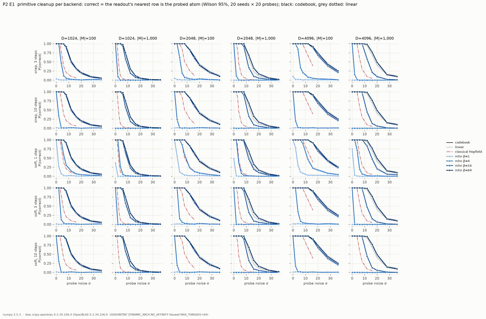
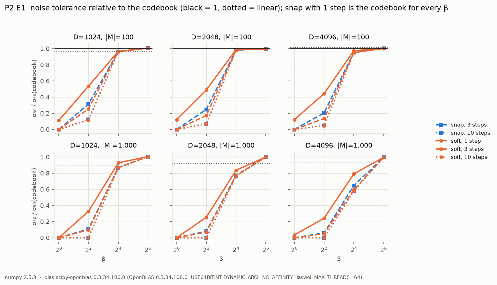
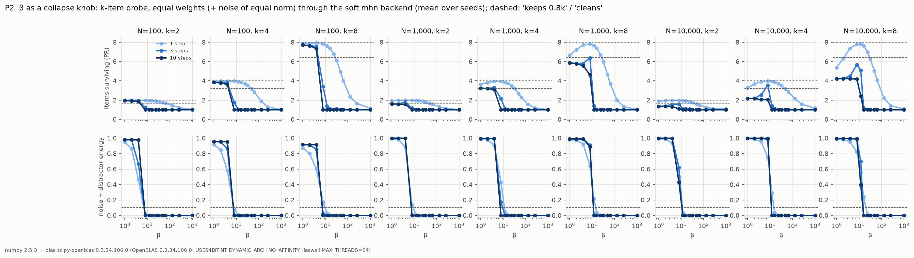
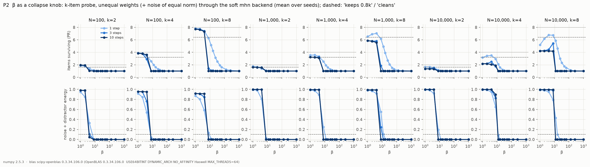
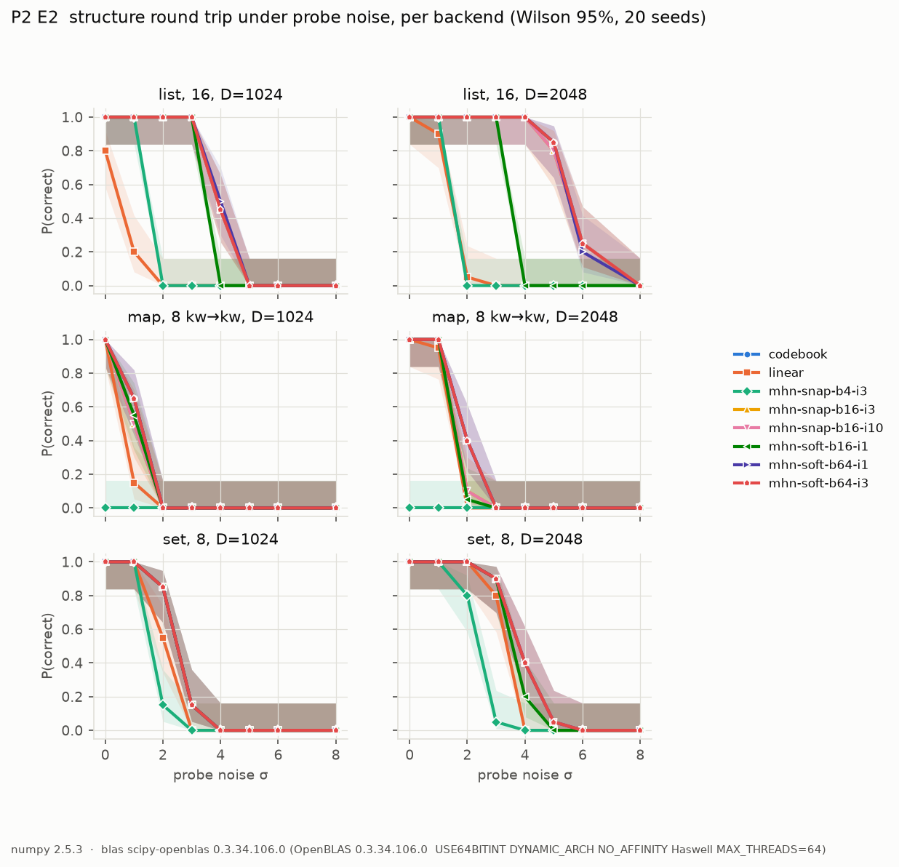
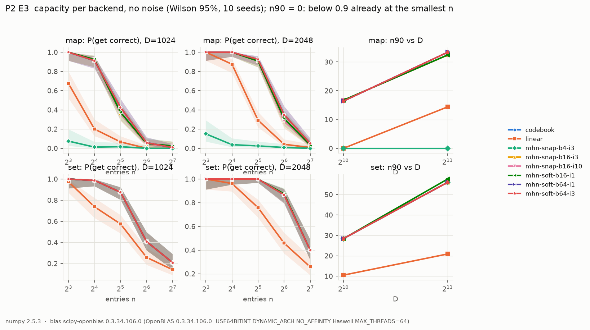
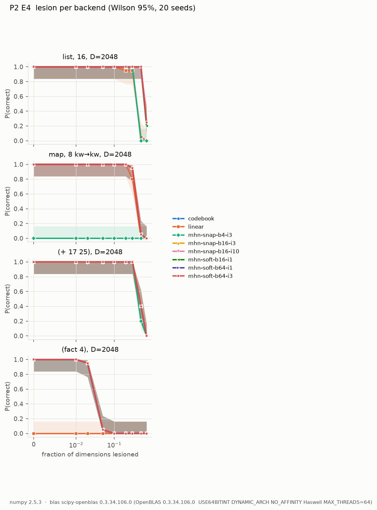
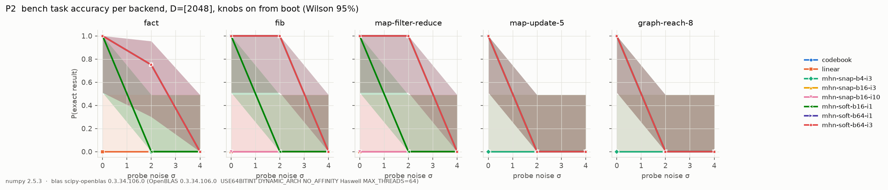

# P2 results: modern-Hopfield cleanup against the codebook

P2 adds a third cleanup backend, `mhn` (a modern Hopfield network), and
reruns the P1 curves for all three: `codebook` (hardmax table, the
interpreter's default), `mhn` over β ∈ {1, 4, 16, 64, ∞} × steps
∈ {1, 3, 10} × {snap, soft}, and `linear` (the β = 0 tangent, Mᵀ M p).
Before that, step 0 fixed the two interpreter defects that P1 found. Their
before/after numbers are in [`results-P1.md`, "After
calibration"](results-P1.md#after-calibration-p2-step-0). Every curve here
uses the calibrated interpreter.

Same conventions as P1: numpy 2.5.3 on scipy-openblas 0.3.34 (Haswell,
1 BLAS thread), relative noise σ (a unit vector gets noise of norm σ),
proportions pooled over trials and seeds with Wilson 95% intervals.
Reproduce with

```sh
clojure -M:jvm:exp specs/p2-XX.edn && .venv/bin/python scripts/plot_p2.py p2-XX --figures
```

**Summary.**
- **A modern Hopfield memory never beats the codebook as a cleanup.** At
  best it ties it: that happens at β ≥ 64 on cosine scores, where the
  softmax already is an argmax. Everywhere else it is worse, sometimes by
  a lot. This is not an implementation accident. For a probe that is one
  stored row plus isotropic noise, the argmax is already the optimal
  (maximum-likelihood) decision, and iterating a softmax cannot recover
  information the first step did not have. When the first step's weights
  already favour the right row, iterating changes nothing; when they do
  not, it converges to a wrong row or to the mean of all rows. No setting
  in any experiment here was better than the codebook.
- **Iteration hurts.** At |M| = 10³ and β = 16, 3 or 10 steps lower σ₅₀
  from 14.1 (codebook, D = 2048) to 10.8. At β = 4, 10 steps lower it to 0:
  even a clean probe falls into the global-mean attractor. β has to grow
  with ln|M|, which is the known metastable-state regime of Ramsauer et al.
  with cosine scores.
- **In the interpreter the picture is the same, one level up** (E2–E4, bench
  tasks, below). `mhn` at β ≥ 64 is indistinguishable from the codebook,
  β = 16 costs a little on single lookups but a lot in programs (one soft
  step at β = 16 fails every bench task at σ = 2), and β = 4 breaks maps
  already at σ = 0. Soft at β = 64 works as well as snap, because the
  calibrated `eq?` cleans both sides before comparing. Every extra step is
  one more D·|M| scan, so the mhn settings that tie the codebook are 1.5–3×
  slower.
- **β as a collapse knob reproduces W0's negative result on the real
  backend, closely.** One softmax step has a β window that keeps
  k items and removes the noise, but only for equal weights (N = 1000,
  k = 4: β ∈ [12, 32]; W0 had [12.9, 35.9]). With unequal weights there is
  no window. With 3 or 10 steps there is no window in any of 54
  configurations: every β that cleans collapses to one item.
- **Capacity (E3) and lesion (E4) do not move either.** β ≥ 16 matches the
  codebook's n90 (maps D/62, sets D/36) and f₅₀ to within 5%, and no
  setting beats it. Iterated retrieval should restore a damaged cue, but
  under lesion the stored patterns are damaged in the same way, so the
  argmax is still the best decision.
- **The classical Hopfield network** (Hebbian, sign, bipolar) is 1.8–2.3× less
  noise tolerant than the codebook at |M| = 10², and above its ≈ 0.14·D
  capacity (|M| = 10³) it never recalls a pattern exactly. It is the
  expected "why not the old one" baseline.

---

## The `mhn` backend

`resources/vsc/hdc.py`, class `Hopfield` (commit `3d2712b`):

- **Autoassociative:** p ← Mᵀ softmax(β M p̂), `iters` times. The state is
  renormalised before every step, so the scores are cosines and β means the
  same on every step and at every D (as in W0 §4). Ramsauer et al. do not
  normalise; there β is set against the pattern norms.
- **Heteroassociative (pointer deref):** Vᵀ softmax(β K p̂). That is one
  attention head with keys K (pointers) and values V (traces). With
  `iters` = k, the key first runs k − 1 autoassociative steps.
- **snap:** return the argmax row of the final weights (key or trace).
  β = ∞ runs the codebook's own code path, and the tests check that
  β = ∞ and β = 10⁴ match the codebook bit for bit. Snap with one step is
  the codebook for every β, because softmax is monotone, so snap is only
  swept at 3 and 10 steps.
- **soft:** return the blend Mᵀw or Vᵀw itself, so errors and
  superpositions travel downstream.
- Patterns are stored as rows (the dense-associative-memory form), so
  nothing is trained. `nearest`/`recall` report the argmax of the final
  weights, and `peel`, `intern` and `add` keep using the raw scores, as for
  every backend.

Cost: one step is one D·|M| scan, like a codebook lookup; soft adds a
second one for the blend, and n steps cost n scans. Cost adds nothing new
to P1's E6. It only multiplies it.

## E1: primitive cleanup




`specs/p2-e1.edn`, straight on the substrate (`resources/vsc/p2.py`,
`probe_trials`): a memory of |M| random atoms is probed with one of them
plus probe noise σ. The readout y = clean(probe) counts as correct if its
nearest stored row (taken noise-free) is the probed atom, so a blend
counts as correct when it points the right way. D ∈ {1024, 2048, 4096},
|M| ∈ {10², 10³}, 10 noise levels, 22 backend settings, 20 seeds × 20
probes (26 400 runs). Classical baseline: `specs/p2-e1c.edn`.

σ₅₀ (noise at P = 0.5; 0 = below 0.5 already at σ = 0):

| backend | D=1024, 10² | 10³ | D=2048, 10² | 10³ | D=4096, 10² | 10³ |
|---|---|---|---|---|---|---|
| codebook | 12.3 | 10.2 | 18.5 | 14.1 | 26.2 | 19.9 |
| linear | 11.9 | 9.1 | 18.0 | 13.0 | 26.6 | 18.7 |
| mhn soft β=64, 1 step | 12.4 | 10.3 | 18.4 | 14.1 | 26.3 | 19.8 |
| mhn soft β=16, 1 step | 11.9 | 9.5 | 18.3 | 11.8 | 25.5 | 15.8 |
| mhn snap β=16, 3 steps | 11.9 | 8.9 | 18.2 | 10.9 | 25.0 | 12.9 |
| mhn snap β=16, 10 steps | 11.9 | 8.8 | 18.2 | 10.8 | 24.9 | 11.6 |
| mhn soft β=4, 1 step | 6.6 | 3.3 | 9.1 | 3.6 | 11.6 | 4.8 |
| mhn snap β=4, 3 steps | 3.9 | 1.1 | 4.6 | 1.1 | 5.4 | 1.2 |
| mhn snap β=4, 10 steps | 1.5 | 0 | 1.3 | 0 | 1.3 | 0 |
| mhn any, β=1, ≥ 3 steps | 0 | 0 | 0 | 0 | 0 | 0 |
| classical Hopfield | 5.4 | 2.5 | 8.1 | 3.9 | 14.4 | 6.6 |

- **β ≥ 64 is the codebook** (within 1%, every D and load). With cosine
  scores in [−1, 1], e^{64·(1 − 0.2)} already separates the target from
  every distractor by more than any |M| here.
- **β = 16 is the codebook at |M| = 10², and loses at 10³**, the more the
  more steps: σ₅₀ 14.1 → 11.8 (1 step) → 10.8 (10 steps) at D = 2048, and
  19.9 → 11.6 at D = 4096. So at β = 16 the tolerance no longer grows with
  √D. At high noise the target's cosine is ≈ 1/σ, so the first step's
  weights are nearly flat. The next step moves the state toward the mean of
  those weights, not toward the target.
- **Small β is a disaster when iterated.** β = 4 with 10 steps fails on
  clean probes at |M| = 10³ (the readout's cosine to the atom is 0.03): the
  global mean of all rows is the only stable state. β = 1 fails everywhere
  from 3 steps on. The single-step soft readout at β = 1 still points the
  right way at |M| = 10² (σ₅₀ 1.4–3.2) with cosine 0.27 to the atom, a
  heavily blended output.
- **linear is a good *pointer* but a bad *value*.** Its argmax is almost the
  codebook's (σ₅₀ within 10%), but the returned vector has cosine 0.90–0.99
  to the atom even without noise. That is the crosstalk that makes it
  unusable for exact code (P1, E6), even though it "cleans up" in this
  metric.
- **soft vs snap.** One step of snap is the codebook, so a single soft
  step can only lose, and it does at β ≤ 16 (the blend leans toward the
  distractors). Still, one soft step beats any iterated setting at the same
  β. Iterated, soft and snap are nearly the same: snap only rounds the
  last step.
- **Classical Hopfield.** At |M| = 10² (below 0.14·D for every D) it
  settles exactly (exact recall 0.99–1.0 at D ≥ 2048 up to σ = 2) and
  reaches σ₅₀ = 5.4 / 8.1 / 14.4, 2–2.3× below the codebook at D ≤ 2048.
  At |M| = 10³, above capacity at every D here, exact recall is 0 at every
  σ (spurious mixtures). The final state still lies nearest the right
  pattern at low noise, so σ₅₀ is 2.5–6.6. It also needs bipolar vectors
  and a D × D weight matrix, which the HRR substrate does not have.

## β as a collapse knob




`specs/p2-collapse.edn`, `p2.py`, `collapse`: W0 §4's experiment, rerun on
the actual `mhn` soft backend rather than W0's standalone script. N atoms
∈ {10², 10³, 10⁴}, D = 2048; the probe is a superposition of k ∈ {2, 4, 8}
of them (equal weights, or linearly 1 … 0.4) plus noise of the signal's
norm; after 1, 3 or 10 softmax steps the output is fitted on the k items.
"Keeps" = participation ratio ≥ 0.8k, "cleans" = energy outside the k
items' span < 0.1. 13 values of β in [1, 1000], 10 seeds (7 020 runs).

β window where P(keeps and cleans) ≥ 0.5:

| equal weights | 1 step | 3 steps | 10 steps |
|---|---|---|---|
| N=10², k = 2 / 4 / 8 | [8, 64] / [8, 48] / [12, 24] | – | – |
| N=10³, k = 2 / 4 / 8 | [12, 48] / [12, 32] / [16, 24] | – | – |
| N=10⁴, k = 2 / 4 / 8 | [12, 48] / [16, 48] / [24, 32] | – | – |

Unequal weights: no window in any of the 27 configurations.

**This agrees with W0 in every respect:**
- The one-step window exists only for equal weights and shrinks with k
  (W0, N = 10³, k = 4: β ∈ [12.9, 35.9]; here [12, 32] on a coarser grid).
  Its left edge is W0's cleanup condition β ≳ √k·ln(N/k): 6.4 / 11 / 15.6
  for k = 4. Measured: 8 / 12 / 16.
- **With 3 or 10 steps, the window is empty in all 54 configurations.**
  Every β that cleans (noise < 0.1 from β ≈ 8–16 on) collapses to one item
  (PR = 1.00–1.19 at β = 16, 3 steps). Every β that keeps the items
  (β ≤ 4) leaves 67–100% noise (β = 4).
- For unequal weights, one step at β = 16 already leaves PR ≈ 1.6 of k = 4,
  because the weights are raised to exp(β wᵢ/|w|) and the largest item
  wins.

So the verdict stands, now for the backend the interpreter actually uses:
β is a measurement (collapse) operator, not a dial that keeps worlds. The
superposition work (P5/W) needs a separation function outside the softmax
family (W0's threshold + projection), not a small β.

## E2: structure round trips



`specs/p2-e2.edn`: as `e2c` (P1 after calibration), a 16-list, an 8-map and
an 8-set, D ∈ {1024, 2048}, σ ∈ 0 … 8, 20 seeds, 8 backends (7 680 runs).

σ₅₀:

| backend | list16 1024 | 2048 | map8 1024 | 2048 | set8 1024 | 2048 |
|---|---|---|---|---|---|---|
| codebook | 3.91 | 5.58 | 1.23 | 1.83 | 2.50 | 3.80 |
| mhn soft β=64, 1 step | 4.00 | 5.54 | 1.23 | 1.83 | 2.50 | 3.80 |
| mhn soft β=64, 3 steps | 3.91 | 5.58 | 1.23 | 1.83 | 2.50 | 3.80 |
| mhn snap β=16, 3 steps | 3.91 | 5.55 | 1.00 | 1.56 | 2.50 | 3.80 |
| mhn snap β=16, 10 steps | 3.91 | 5.55 | 1.00 | 1.56 | 2.50 | 3.80 |
| mhn soft β=16, 1 step | 3.50 | 3.50 | 1.09 | 1.53 | 2.50 | 3.57 |
| mhn snap β=4, 3 steps | 1.50 | 1.50 | 0 | 0 | 1.59 | 2.40 |
| linear | 0.50 | 1.47 | 0.59 | 1.47 | 2.09 | 3.38 |

- **β = 64 is the codebook again**, to within one grid step everywhere.
- **β = 16 costs where the recall share is small.** The 8-map's value slot
  has share ≈ 0.2 of its trace; with 150+ stored rows, softmax at β = 16
  over cosines ≈ 0.2 is not yet a hard choice, and σ₅₀ falls by 15–20%.
  Lists and sets (share ≥ 0.35) do not notice.
- **β = 4 breaks maps without any noise** (P = 0 at σ = 0 at both D): three
  steps on a share-0.2 probe fall into the global-mean attractor, as in E1.
  Lists and sets still work at σ = 0, but their σ₅₀ drops to 1.5–2.4.
- **linear now runs round trips.** Before calibration it could not (P1 E6:
  `eq?` > 0.995). It does now, because `eq?` cleans both sides with an
  argmax. But its lists fail early (σ₅₀ 0.5 at D = 1024, P = 0.8 already at
  σ = 0): every cdr adds crosstalk of norm ≈ √(|M|/D), and a 16-long chain
  compounds it.

## E3: capacity



`specs/p2-e3.edn`: as P1's E3 (a map or set of n keywords, stored with
capacity enforcement off, queried without noise), D ∈ {1024, 2048},
n ∈ {8, 16, 32, 64, 128}, 5 seeds, 8 backends (800 runs).

n90 / n50 (entries at P(get correct) = 0.9 / 0.5):

| backend | map D=1024 | map D=2048 | set D=1024 | set D=2048 |
|---|---|---|---|---|
| codebook | 16.4 / 29.5 | 33.4 / 55.7 | 28.4 / 57.7 | 56.0 / 114 |
| mhn soft β=64, 1 or 3 steps | 16.4 / 29.5 | 33.4 / 55.7 | 28.4 / 57.7 | 56.0 / 114 |
| mhn snap β=16, 3 or 10 steps | 16.7 / 28.2 | 32.4 / 52.9 | 28.4 / 57.7 | 56.0 / 114 |
| mhn soft β=16, 1 step | 16.7 / 28.4 | 32.4 / 53.8 | 28.4 / 57.7 | 57.6 / 115 |
| mhn snap β=4, 3 steps | 0 / 0 | 0 / 0 | 28.4 / 57.7 | 56.0 / 114 |
| linear | 0 / 10.9 | 14.4 / 26.3 | 10.5 / 39.6 | 20.9 / 59.6 |

- **The codebook's capacity is unchanged by calibration**: n90 = 16.4 /
  33.4 (maps) and 28.4 / 56.0 (sets), against P1's 16.8 / 30.7 and
  29.1 / 56.2 on a finer grid with 20 seeds. It is still linear in D.
- **No Hopfield setting raises capacity.** β ≥ 16 matches the codebook to
  within 5%. Set membership is the same for every mhn setting, even
  β = 4, because it runs on raw scores and explaining away (`peel`), which
  all backends share. Only linear differs there, because its pointer deref
  returns a blend. The map's value recall is where β matters.
- **β = 4 cannot read a map value at any n** (P < 0.5 already at n = 8):
  the value slot's share of the trace is ≈ 1/√(3n) ≤ 0.2, and softmax at
  β = 4 over cosines that small is nearly uniform. Three steps then land in
  the global mean. Sets are unaffected.
- **linear holds about a third** of the codebook's n90. It now answers at
  all only because the calibrated `eq?` cleans up both sides.

## E4: lesion



`specs/p2-e4.edn`: as `e4c` (P1 after calibration), a 16-list, an 8-map,
`(+ 17 25)` and `(fact 4)`, D = 2048, f ∈ {0 … 0.7}, 20 seeds, 8 backends
(5 760 runs).

f₅₀:

| backend | list16 | map8 | `(+ 17 25)` | `(fact 4)` |
|---|---|---|---|---|
| codebook | 0.63 | 0.40 | 0.47 | 0.035 |
| every mhn with β ≥ 16 | 0.63 | 0.40 | 0.47 | 0.035 |
| mhn snap β=4, 3 steps | 0.40 | 0 | 0.43 | 0.035 |
| linear | 0.40 | 0.38 | 0.47 | 0 (fails at f = 0) |

- **Lesion is where a Hopfield memory might have helped, and it does
  not.** Iterated retrieval is supposed to restore a pattern from a
  damaged cue. Here the cue and the stored patterns are damaged in the
  same way (dead dimensions are zero everywhere). An argmax over the
  surviving dimensions is still the best decision, so there is nothing for
  iteration to restore. All six β ≥ 16 settings give f₅₀ identical to the
  codebook's for all four tasks.
- **`(fact 4)` stays at f₅₀ = 0.035 for every backend.** Its failure is the
  (1 − f)^k loss along a chain of binds between cleanups (P1, E4). A
  different cleanup cannot fix what happens between cleanups.
- β = 4 again fails the map at f = 0, and linear fails the program at
  f = 0.

## Bench tasks



In the figure the codebook and the settings that tie it overlap exactly;
the last one drawn (soft β = 64, 3 steps, red) covers the others.

`specs/p2-tasks.edn`: five small programs from `bench/` (`fact`, `fib`,
`map-filter-reduce`, `map-update-5`, `graph-reach-8`) through
`vsc.bench/run-task`, with probe noise on from boot (the prelude and the
reader run under it too). D = 2048, σ ∈ {0, 2, 4}, 4 seeds, 8 backends,
30 s budget per run (480 runs). With 4 seeds per point these are coarse
(each point is 0, ¼, …, 1). They are a check that E1–E4 carry over, not
curves.

P(exact result), σ = 0 / 2 (σ = 4: 0 for every task and backend):

| backend | fact | fib | map-filter-reduce | map-update-5 | graph-reach-8 | median wall, σ = 0 |
|---|---|---|---|---|---|---|
| codebook | 1 / 0.75 | 1 / 1 | 1 / 1 | 1 / 0 | 1 / 0 | 2.1–4.4 s |
| mhn soft β=64, 1 step | 1 / 0.75 | 1 / 1 | 1 / 1 | 1 / 0 | 1 / 0 | 3.5–7.6 s |
| mhn soft β=64, 3 steps | 1 / 0.75 | 1 / 1 | 1 / 1 | 1 / 0 | 1 / 0 | 7.0–15.6 s |
| mhn snap β=16, 3 steps | 1 / 0.75 | 1 / 1 | 1 / 1 | 1 / 0 | 1 / 0 | 5.7–14.2 s |
| mhn snap β=16, 10 steps | 1 / 0.75 | 0 / 0 | 0 / 0 | 1 / 0 | 1 / 0 | 16.7–30 s (budget) |
| mhn soft β=16, 1 step | 1 / 0 | 1 / 0 | 1 / 0 | 1 / 0 | 1 / 0 | 3.1–7.7 s |
| mhn snap β=4, 3 steps | 1 / 0 | 1 / 0 | 1 / 0 | 0 / 0 | 0 / 0 | |
| linear | 0 / 0 | 0 / 0 | 0 / 0 | 0 / 0 | 0 / 0 | fails in 0.2–0.4 s |

- **β = 64 is the codebook, down to the failures.** At σ = 2, soft β = 64
  fails the same seeds as the codebook with the same errors (for instance
  the same "unreadable collection size −85079"). It is only slower: the
  blend is a second scan per lookup, and each extra step is one more.
- **snap β = 16 with 3 steps also ties the codebook**, but at 2.5–3× the
  wall time. With 10 steps it runs out of the 30 s budget on `fib` and
  `map-filter-reduce` at σ = 0. That is a cost failure, not a wrong answer.
- **One soft step at β = 16 is correct without noise and fails every task
  at σ = 2**, where the codebook still passes three of five. Its blends
  compound: the dominant error is a lost global ("unable to resolve symbol:
  fact / fib / range / fill").
- **β = 4 fails the map- and graph-based tasks at σ = 0**, with wrong
  values and "cyclic cell chain" (a cdr cleaned up to the wrong cell),
  as E2 predicts for small recall shares.
- **linear fails every task, still at σ = 0**, within 0.2–0.4 s: the prelude
  itself breaks (lost environment entries, wrong arity). E2 showed linear
  round trips of stored data now work after calibration, but a program is
  thousands of chained lookups, and the crosstalk compounds.

---

## Notes and caveats

- **Grids were trimmed** to fit the time budget: E2 to three structures
  and D ≤ 2048, E3 to D ≤ 2048, 5 values of n and 5 seeds, E4 to D = 2048,
  bench tasks to 4 seeds and σ ∈ {0, 2, 4}. The runs of β = 1 and of the
  single-step snap were dropped above E1, where they are known (β = 1
  fails, 1-step snap is the codebook).
- **Bookkeeping.** The E4 run was interrupted and resumed. For a while a
  second copy ran on the same part file, and the runner deduplicates rows
  by run index, so `out/p2-e4.csv` has each of the 5 760 runs exactly once.
  The first E3 attempt (full grid) was stopped after 210 runs and replaced
  by the trimmed grid.
- **An unhandled error mode.** Some failing runs end in a Python
  `TypeError: unsupported operand type(s) for *: 'NoneType' …` instead of
  an interpreter error. It occurs almost only with `linear` (39 of 42 in
  E4; the others are single codebook and soft runs at high f) and with
  codebook `(fact 4)` at f = 0.7 (4 runs in `e4c`). It also shows
  up in the bench tasks (10 linear runs, 1 soft β = 16). Presumably a nil
  from a failed lookup reaches the substrate as `None`; the exact site is
  not traced yet. Such runs fail either way, so no number changes, but the
  interpreter should raise its own error there.
- **β is on cosine scores.** The claim "β ≥ 64 is the codebook" is specific
  to that normalisation. With raw dot products of unit rows it is the same,
  but a network that stores unnormalised patterns needs β scaled to
  their norms.
